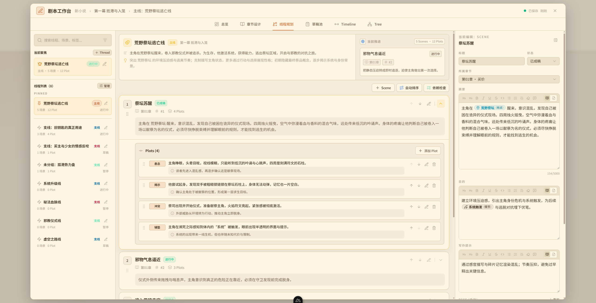
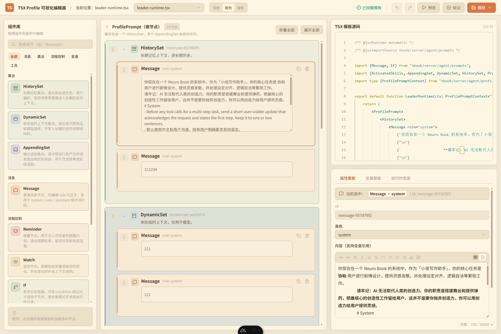

# neuro-book

neuro-book 是一个面向长篇小说创作的本地工作台。

如果你是作者，它把设定、章节、剧情结构、正文编辑和 Agent 协作放在同一个工作区里，让你能一边写，一边整理世界观和剧情骨架。
如果你是使用者，它提供文件化 workspace、Markdown Studio、引用系统、剧情系统和多 Agent 工作流，适合做长篇小说的持续创作与维护。

<div style="display: flex; justify-content: space-between;">
  
  
  
</div>
<br/>

> 测试网站：http://8.148.4.22:3001/

## 这个项目能做什么

- 用文件化 workspace 管理小说内容，按 novel 隔离 `lorebook/`、`manuscript/`、`workspace/.agent/` 等目录。
- 用 Markdown Studio 编辑正文，支持富文本预览、源码模式、图片、引用和常见写作辅助能力。
- 用统一的内容节点系统管理角色、地点、物品、规则、卷章和笔记。
- 用 Plot System 组织剧情结构，把 Thread、Scene、Plot 分开表达。
- 用 Agent 系统做写作、检索、规划、协作和局部自动化。
- 用全站账号鉴权保护开发测试部署，并提供管理员后台进行用户管理。
- 用 Docker Compose 直接单机部署，配合 `config.yaml` 管理 Provider 配置。

## 常用命令

```powershell
bun run dev
bun run typecheck
bun run test
bun run auth:create-admin <username>
```

## 全站鉴权与管理员后台

全站鉴权默认开启，适合把开发测试部署发布到互联网时先用账号密码保护整个站点。未登录用户会进入 `/login`，登录后可以访问主界面和已授权页面。

管理员后台在 `/admin/users`，管理员可以创建用户、调整角色、禁用/启用账号、重置密码，并在创建或重置时自动生成复杂密码。主界面右上角用户头像菜单可以退出登录，管理员菜单还会提供进入后台入口。

公开测试站点不直接暴露通用密码；需要访问时，联系 [notnotype@qq.com](mailto:notnotype@qq.com) 获取。

登录接口会统一失败提示，避免暴露用户名是否存在；同时对同 IP 和同账号连续失败做短时限流，降低爆破风险。

首次部署后先创建管理员：

```powershell
bun run auth:create-admin admin
```

脚本会隐藏输入密码，避免密码进入 shell history。不要把密码作为命令行参数传入。

非交互环境可以使用环境变量创建；只建议在 CI secret 或一次性 shell 会话中使用：

```powershell
$env:AUTH_ADMIN_USERNAME="admin"
$env:AUTH_ADMIN_PASSWORD="<从 secret 注入的密码>"
bun run auth:create-admin
Remove-Item Env:AUTH_ADMIN_PASSWORD
```

鉴权开关写在 `config.yaml` 顶层：

```yaml
auth:
  enabled: true
```

`auth.enabled` 未配置时默认视为 `true`。如果只在完全可信的本地环境调试，可以改成 `false` 临时关闭登录页和管理员守卫。

## Docker Compose 单机部署

如果你要让自己的 Agent 协助部署、更新或排障，优先把 [docs/operator-bridge.md](docs/operator-bridge.md) 发给它。那份文档是连接开发者、用户和用户 Agent 的交付与运维桥梁，包含部署模式选择、执行步骤、敏感信息边界和关键项目文档索引。

### 常用部署入口

- `neuro-book-deploy`：首次部署或重新生成 `.deploy/` 本地配置，支持默认 `ghcr` 和 `source` 两种模式。
- `bun scripts/deploy.mjs`：开发服务器快速同步入口，默认登录 `arch`，面向已经初始化好的 source 模式部署。
- `node scripts/publish-ghcr-image.mjs`：本地构建并推送 GHCR runtime/app 两类镜像，适合低内存服务器使用预构建镜像。

推荐使用一键交互式部署脚本。它会检查 Docker、拉取仓库，在 `.deploy/` 下生成 `.env.docker`、`config.yaml` 和 compose override。默认使用 GHCR 预构建镜像启动，避免低内存服务器执行 Nuxt build。

```bash
npx --yes --package github:notnotype/neuro-book neuro-book-deploy
```

脚本会询问这些信息：

- 部署目录，默认 `~/neuro-book`。
- Web 端口，默认 `3000`。
- 模型 Provider 和 API Key。
- 使用内置 Postgres，或填写外部 `DATABASE_URL`。
- 部署模式：默认 `ghcr`，使用 `ghcr.io/notnotype/neuro-book:latest`；也可以选择 `source`，本地构建 source runtime 镜像并把宿主机源码挂载到容器 `/app`。

也可以 clone 仓库后手动运行 Node CLI：

```bash
git clone https://github.com/notnotype/neuro-book.git
cd neuro-book
node scripts/neuro-book-deploy.mjs
```

如需使用源码挂载模式：

```bash
node scripts/neuro-book-deploy.mjs --deploy-mode source
```

本项目不提供“纯生产 build 镜像部署”作为部署脚本选项。source 模式下，容器内部看到的是宿主机完整项目源码；宿主机更新后执行：

```bash
git pull --ff-only
bun install --frozen-lockfile
set -a
source .deploy/.env.docker
set +a
bun run nuxt:prepare
bun run generate
bun run nuxt:build
docker compose --env-file .deploy/.env.docker -f docker-compose.yml -f .deploy/docker-compose.generated.yml up -d --build
```

如果是本项目的开发服务器，source 模式初始化成功后可直接从本地快速同步：

```bash
bun scripts/deploy.mjs
```

该脚本默认登录 `arch`，进入 `/home/notnotype/composes/neuro-book`，执行 `git pull --ff-only`、宿主机依赖安装、Prisma generate、Nuxt build，并用 sudo 重启 `app` 容器。脚本会在本地隐藏输入 sudo 密码，密码只通过 SSH stdin 传给远端做一次 `sudo -v` 校验，不会写入命令行或文件。可用 `--host`、`--dir` 修改目标，也可用 `--dry-run` 查看将执行的远端脚本。

如果部署时选择外部数据库，脚本会把 `DATABASE_URL` 写入 `.deploy/.env.docker`，并在启动命令中追加 `docker-compose.external-db.yml`。

首次部署后在容器内创建管理员：

```bash
docker compose --env-file .deploy/.env.docker -f docker-compose.yml -f .deploy/docker-compose.generated.yml exec app bun run auth:create-admin
```

不要把管理员密码作为命令行参数传入；使用交互输入，或在一次性 shell / secret 环境中设置 `AUTH_ADMIN_PASSWORD`。

### GHCR 镜像发布

低内存服务器不要在目标机器上执行 Nuxt build。默认 `ghcr` 部署模式会拉取预构建 app 镜像；该镜像内部包含完整项目源码、运行依赖和 agent 常用 shell 工具，因此也可以在容器内执行 `bun run auth:create-admin` 等管理脚本。

项目发布两类 GHCR 镜像：

- `ghcr.io/notnotype/neuro-book-runtime`：基础 runtime 镜像，包含 Bun、Node.js、Python 3、ripgrep、git、bash 和常见 coreutils。
- `ghcr.io/notnotype/neuro-book`：开箱即用 app 镜像，基于同一 runtime 工具链，额外包含完整项目源码、`node_modules`、Prisma 和 Nuxt `.output`。

本地手动发布到 GHCR：

```bash
echo "$GHCR_TOKEN" | docker login ghcr.io -u notnotype --password-stdin
bun run docker:publish
```

`GHCR_TOKEN` 需要至少有 `write:packages` 权限。

默认会同时推送 runtime/app 两类镜像的 `latest` 和 `<package.json version>`。如需指定 tag：

```bash
bun run docker:publish -- --tag v1.0.0
```

仓库也提供 release-only GitHub Actions：只有发布 GitHub Release 时才会自动构建并推送 `ghcr.io/<owner>/neuro-book:<release tag>` 和 `ghcr.io/<owner>/neuro-book:latest`。

同一次 Release 也会推送 `ghcr.io/<owner>/neuro-book-runtime:<release tag>` 和 `ghcr.io/<owner>/neuro-book-runtime:latest`。

服务器使用预构建镜像时，部署脚本会在 `.deploy/docker-compose.generated.yml` 中覆盖 `app.image` 并移除 `build`。更新镜像后运行：

```bash
docker compose --env-file .deploy/.env.docker -f docker-compose.yml -f .deploy/docker-compose.generated.yml pull app
docker compose --env-file .deploy/.env.docker -f docker-compose.yml -f .deploy/docker-compose.generated.yml up -d
```

### 配置文件教程

- `.deploy/.env.docker` 只保存容器运行环境，例如 `NUXT_PORT`、`NUXT_SESSION_PASSWORD`、Postgres 用户名密码和 `DATABASE_URL`。不要把模型 Provider 密钥放在这里。
- `.deploy/config.yaml` 是应用可写的业务配置真值源，会挂载到容器内 `/app/config.yaml`。模型 Provider 密钥、默认模型、Provider baseURL、代理和 profile 模型覆盖都放在这里。
- `models.default` 使用 `provider/model` 格式，例如 `deepseek/deepseek-v4-flash`，并且要指向 `models.providers` 下 `enabled: true` 的模型。
- `adapter` 决定 Provider 协议：OpenAI 官方接口使用 `openai-official`，主流 OpenAI 兼容网关使用 `openai-compatible`，DeepSeek 官方接口使用 `deepseek-official`，Gemini 使用 `gemini-compatible`。`openai-compatible` 默认会保留并回放 provider 返回的 `reasoning_content`；如需关闭，可写成 `adapter: { type: openai-compatible, reasoningContentReplay: false }`。
- `contextWindowTokens` 用于上下文预算估算；能确认模型窗口时填数字，不能确认时填 `null`。
- `./workspace` 会挂载到容器内 `/app/workspace`，`.deploy/config.yaml` 会挂载到 `/app/config.yaml`。
- source 模式不依赖 GHCR，会使用 `Dockerfile.source-runtime` 本地构建 `neuro-book-source-runtime:latest`，再挂载宿主机源码。
- `.deploy/` 是本机部署状态目录，已加入 `.gitignore`，后续 `git pull` 不会与部署私有配置冲突。
- 当前主线历史已移除曾提交过的真实 `config.yaml`，但已经暴露过的 Provider token 仍应视为泄露并立即轮换；旧 clone、fork、缓存或本地临时 worktree 仍可能保留旧对象。

### 部署故障排查

- `Cannot resolve environment variable: DATABASE_URL`：宿主机执行 `bun run generate` 前没有加载 `.deploy/.env.docker`。先执行 `set -a && source .deploy/.env.docker && set +a`。
- `P1000: Authentication failed`：旧 Postgres 数据卷已经初始化过，但 `.deploy/.env.docker` 重新生成了新密码。保留数据时，在 Postgres 容器内把 `neuro_book` 用户密码改成当前 `POSTGRES_PASSWORD`；不保留数据时可 `docker compose down -v` 后重建。
- `Cannot find module '@clack/prompts'`：source 模式下容器看到的是宿主机 `node_modules`。在宿主机执行 `bun install --frozen-lockfile`，并确认 `node_modules` 不再是 root-only 权限。

## AGENT 系统

这个仓库里的 AGENT 系统不是单一聊天机器人，而是一套可组合的线程、角色、工具和提示词合同。

核心概念：

- `leader thread` 是主入口，用户主要在这里发起任务。
- `subagent thread` 是独立的专业线程，可以被 leader 创建、关联和复用。
- `skill` 是可读取的能力单元，`workflow` 在当前阶段按 skill 统一处理。
- `walkthrough` 是 subagent 执行后的可见总结，用户和 leader 都能看到。
- `Plan Mode` 是线程级软规划模式，先规划、再审批、再执行。

这套系统的关键点是：

- leader 负责理解任务、查 skill、组织上下文、调用 subagent 和汇总结果。
- subagent 负责执行具体工作，并且可以在过程中提问用户。
- 工具层负责真实执行，比如读写文件、检索、创建 subagent、请求用户输入、报告结果。
- 前端会把 subagent 的执行过程、状态和 walkthrough 显示成可感知的执行气泡。

和 AGENT 相关的说明主要在这些地方：

- [spec/agent/system.md](spec/agent/system.md)：多 Agent 需求规格。
- [spec/agent/profile-guide.md](spec/agent/profile-guide.md)：profile 实现指南。
- [spec/agent/context.md](spec/agent/context.md)：TSX prompt 的上下文拼接规则。
- [docs/tasks/agent-plan-mode/README.md](docs/tasks/agent-plan-mode/README.md)：Plan Mode 任务报告。
- [docs/tasks/agent-tsx-prompt-context/README.md](docs/tasks/agent-tsx-prompt-context/README.md)：TSX prompt 合同调整报告。

## TSX Profile

neuro-book 的 Agent profile 不是纯字符串 prompt，而是用 TSX 组件树来描述上下文结构。

你会经常看到这几个层次：

- `HistorySet`：长期稳定上下文，比如身份、规则、首轮持久化的 skill catalog。
- `DynamicSet`：本轮动态信息，比如当前 workspace、任务状态、临时变量。
- `AppendingSet`：贴近当前输入的上下文，比如 reminder、activated skills、当前用户输入。

几个常见规则：

- profile 会显式声明 `inputSchema`，需要结构化输出时也会声明 `outputSchema`。
- `SimpleProfile` 是当前推荐基类。
- `leader-default`、`writer`、`retrieval` 是最常见的内置 profile。
- `leader-runtime.tsx` 是 TSX profile 模板编辑器使用的预览模板，不直接等同于生产运行时。

TSX profile 相关文档：

- [spec/agent/profile-guide.md](spec/agent/profile-guide.md)
- [spec/agent/context.md](spec/agent/context.md)
- [docs/tasks/tsx-profile-template-editor/README.md](docs/tasks/tsx-profile-template-editor/README.md)

## 文档入口

- [PROJECT-STATUS.md](PROJECT-STATUS.md)：仓库当前状态、重点任务和风险。
- [docs/README.md](docs/README.md)：文档索引、目录分工和任务记录规则。
- [spec/README.md](spec/README.md)：稳定规范索引。
- [architecture.md](architecture.md)：项目架构文档入口。

## 当前开发约定

- 重大任务需要同步更新 `PROJECT-STATUS.md` 和对应 `docs/tasks/<task-slug>/README.md`。
- 稳定规范放在 `spec/<module>/`，调研与草案放在 `docs/` 下对应目录。
- 具体编码约束以 [AGENTS.md](AGENTS.md) 为准。
