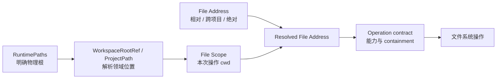
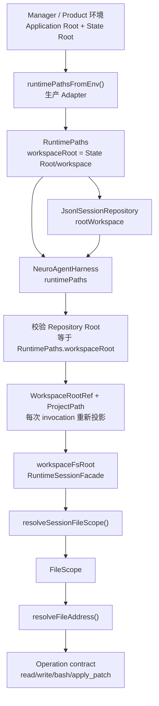

# Task 109：统一 File Scope、File Address 与 Product Runtime 路径合同

> 当前状态：实现中（`0.8.5`公开Product Bun、Windows Portable和Release门禁已闭合，GHCR待Manager`.19`与应用`0.8.6`完成）。Generic File Path、Project Path、File Scope、Resolved File Address 与不可变 RuntimePaths 已完成硬切；Workspace Files/History、World Engine/Plot、Profile/Skill Catalog、Harness、Session Repository 和 bash 均由进程/HTTP Adapter 显式传入物理根，核心 Module 不再重新发现 cwd 或环境。共享 State Root integrity 由 Manager doctor/status/start 与应用 bootstrap 共用。Arch公开Product Bun已完成Attachment/五工具/Config/Profile/Variable/State Root移动与HTTP；GHCR在这些路径检查前被Manager one-off ENTRYPOINT argv错误阻断，修复不改变路径合同。

## Relative documents refs

- [Project status](../../../PROJECT-STATUS.md)
- [Workspace terms](../../../reference/workspace/TERMS.md)
- [Project Workspace guide](../../../reference/agent/project-workspace-guide.md)
- [Workspace tool use](../../../reference/agent/workspace-tool-use.md)
- [Task 105：统一安装与 Manager](../105-unified-installation-manager/README.md)
- [Task 108：Agent 图片附件引用](../108-agent-image-attachment-references/README.md)

## User Request / Topic

- 重新审查 Agent Workspace Root 逻辑引用与物理路径实现。
- 解释当前路径解析为什么复杂，并建立更统一的系统心智。
- 清理 Project Path、Workspace Root Reference、文件地址和 cwd 的重复解析与 heuristic。
- Agent 不再拥有 `resolveAgentFile` 一类专用解析器；Agent 与其他调用方使用同一个通用路径 Module。
- 确保 Windows Portable、分离 State Root、Product Bun 和容器运行时遵守同一套路径合同。
- 在真实 Product 产物而不是只有源码 Harness 中验证 Agent 文件工具。

## Goal

完成后应同时满足以下结果：

- 调用方先确定“在哪里操作”的 `File Scope`，再解析“操作哪个文件”的 `File Address`；路径 Module 不从 cwd、目录名或字符串前缀猜测领域身份。
- Project-bound Agent 的文件工具与 bash 共享当前 Project Workspace 作为 File Scope；当前项目使用 Project-relative 路径，跨项目只使用正式 Project File Address。
- 逻辑引用、领域定位符和物理路径通过明确类型与 Interface 分层；DTO 可以接收字符串，但进入运行时 Module 时必须立即规范化。
- Config、Profile Home、Variable、Workspace API、History、World Engine 和 Agent 不再各自复制 `workspaceRoot` / `projectPath` 字符串解析。
- 生产 Runtime 从显式 Application Root / State Root 建立 `RuntimePaths`；cwd 推断只存在于开发和测试 Adapter。
- State Root 与 Installation Root 分离时，错误影子 `workspace/` 能被 Manager、应用 bootstrap 和容器入口一致发现，但系统不自动移动或合并用户数据。
- 无根 `node_modules` 的真实 `.output` 能在独立 State Root 下执行 Agent read/write/edit/apply_patch/bash，且 Installation Root 不产生错误 `workspace/`。

验证证据包括通用 Module 测试、类型检查、Agent Harness 集成测试、State Root integrity 测试、Product runtime smoke、Windows Portable 与 SSH Arch 链路。若公开 Product 或平台环境暂不可用，Task 保持“实现中”，记录已完成范围、缺失证据和解除阻塞所需条件，不用源码测试冒充发布产物验证。

## Problem statement

### 复杂度不是目录数量造成的

NeuroBook 本身确实存在多个合法根：Installation Root、Application Root、State Root、Workspace Root、Workspace Root `.nbook` 和 Project Workspace。真正的问题不是这些概念太多，而是历史实现把不同问题都表示成 `workspaceRoot: string`，再由每个调用方自行猜测字符串语义。

历史复杂度来自四种职责混在一起：

1. **运行时根发现**：Application Root 和 State Root 在哪里。
2. **领域引用解析**：`workspace`、`workspace/.nbook`、`workspace/<project>` 分别指向什么。
3. **文件地址解析**：相对路径、跨项目地址和绝对路径如何变成物理文件路径。
4. **操作权限与安全**：调用方是否允许绝对路径、是否必须限制在某个根内、如何防止 symlink/junction 逃逸。

当这四层混在一个 helper 中时，调用方必须了解 cwd、State Root、Project Path、兼容 alias 和文件系统安全细节。Module 的 Interface 与 Implementation 同样复杂，缺乏深度和 locality；修复一个路径 bug 也无法约束其他调用方。

### 已确认的历史错误

- Agent session 的逻辑 `workspaceRoot` 曾被直接当成文件系统 cwd。
- 同一个 `resolveWorkspacePath` 名称承担过不同语义。
- Agent 文件工具曾接受裸 Project-relative、`<project-slug>/...` 和 `workspace/<project>/...` 多套输入，并从物理路径反推 Project Path。
- Runtime 在生产路径缺少显式 root 时，会从 cwd 向上寻找名为 `workspace` 的祖先目录。
- Config、Profile Home 和 Variable 曾各自处理绝对路径、`.nbook` 后缀和 cwd 相对路径。
- lexical containment 能拒绝 `..`，但不能单独阻止已存在 symlink/junction 指向根外。

## Stable path contract

### 单一心智模型

每次文件操作只回答三个问题：

1. **File Scope：在哪里操作？**
2. **File Address：操作哪个文件？**
3. **Operation contract：这个操作允许什么？**



Agent 只负责把 session metadata 投影成 File Scope。它不定义文件路径语法，因此不建立 `resolveAgentFile`。

### 五种数据不能再共用一个 `string`

| 数据 | 语义 | 生命周期 | 允许进入文件系统操作 |
| --- | --- | --- | --- |
| `RuntimePaths` | 当前进程的 Application Root、State Root 与派生物理根 | 进程级不可变值 | 可以，字段均为 `AbsoluteFsPath` |
| `WorkspaceRootRef` | Session 可持久化的逻辑 root 引用 | 跨进程、随 session 持久化 | 不可以，必须先投影 |
| `ProjectPath` | managed Project Workspace 的领域定位符 | 可持久化领域数据 | 不可以，必须结合 managed Workspace Root 解析 |
| `FileScope` | 一次 invocation 的物理 cwd 与 managed Project 命名空间 | 单次执行 | 可以，作为 File Address 解析上下文 |
| `File Address` / `ResolvedFileAddress` | 用户或工具指定的文件及其规范化结果 | 单次文件操作 | 只有解析结果可以 |

Session DTO 为保持现有 JSONL 合同仍可把逻辑字段命名为 `workspaceRoot`，但 Runtime Interface 中必须区分：

- `workspaceRootRef`：持久化身份、配置选择和子 Agent 继承使用。
- `workspaceFsRoot`：本次运行的物理 root，文件系统调用、Plan Mode 和工具 cwd 使用。

禁止把 DTO 的 `session.workspaceRoot` 直接传给 `resolve()`、`join()`、`fs.*` 或子进程 `cwd`。这条约束由 branded path 与 `RuntimeSessionFacade.workspaceFsRoot` 必填字段共同表达，不靠调用方记忆。

### 生产调用链



这条链路只有两个 Adapter：进程环境到 `RuntimePaths`，以及 session metadata 到 `FileScope`。中间 Module 不再读取 cwd 或环境变量，也不从物理目录名反推领域身份。

### Project-bound File Scope

| Session 类型 | 默认 File Scope root | 普通相对路径示例 | 跨 Project Workspace |
| --- | --- | --- | --- |
| Project-bound managed session | 当前 Project Workspace | `lorebook/character/hero/index.md` | `workspace/other-project/lorebook/...` |
| Workspace session | Workspace Root | `.nbook/config.json` | `workspace/other-project/...` |
| user-assets session | Workspace Root `.nbook` | `agent/profiles/writer/profile.ts` | 不支持 |
| external Project session | 明确的外部绝对 Project Workspace | `manuscript/001.md` | 不自动解析 managed Project Path |

文件工具和 bash 必须使用同一个 File Scope root。`workspace node ...` 由 Project Workspace `.nbook/agent/bin` 注入 bash PATH，因此从 Project Workspace cwd 执行符合现行运行合同。

### 正式 File Address 语法

```text
relative/path                         # 相对当前 File Scope
workspace/<project-slug>/relative     # 显式 Project File Address
<absolute-path>                       # 仅调用方明确允许时
```

规则固定为：

- 当前 Project Workspace 使用 `lorebook/...`、`manuscript/...`、`.agent/...` 等普通相对路径。
- `workspace/<project-slug>/...` 是由 Project Path Module 解析的正式地址，不是从 cwd 剥离字符串的 alias。
- 旧 `<project-slug>/...` 输入明确拒绝，防止在当前 Project Workspace 下静默创建嵌套同名目录。
- `workspace` 或 `workspace/<project>` 缺少文件相对部分时，按具体操作决定是否允许 Project Workspace 根；不能靠空字符串偶然解析。
- 任意其他相对 `workspaceRoot` 引用拒绝，不相对 `process.cwd()` 猜测。
- 外部绝对 Project Workspace 不可迁移；路径失效后只报告，不搜索、不重绑定、不回退。

### 持久化与运行时分离

- Session metadata 继续保存可迁移的逻辑 `WorkspaceRootRef` 和 `ProjectPath`。
- managed session 不持久化当前机器的绝对 File Scope root。
- 每次 invocation 使用当前 `RuntimePaths` 重新投影 File Scope，因此完整 State Root 移动后仍能解析到新物理目录。
- 明确的外部绝对 Project Workspace 保持绝对值；这项能力本身不承诺可迁移。
- 不修改 Installation Manifest schema，不迁移 session JSONL，不加入旧路径 fallback。

## Target Module design

### 1. Runtime Paths Module

职责：从显式 Application Root、State Root 和运行环境建立不可变物理路径集合。

目标 Interface 只暴露调用方真正需要的稳定结果，例如：

```ts
type RuntimePaths = Readonly<{
    applicationRoot: AbsoluteFsPath;
    stateRoot: AbsoluteFsPath;
    workspaceRoot: AbsoluteFsPath;
    userNbookRoot: AbsoluteFsPath;
    bootConfigPath: AbsoluteFsPath;
    stateEnvPath: AbsoluteFsPath;
    logRoot: AbsoluteFsPath;
}>;
```

- 它是普通不可变值，不是全局 service locator 或依赖注入框架。
- Manager、App bootstrap 和 Docker entrypoint 负责建立生产 Adapter。
- 开发与测试可从 cwd 建立独立 Adapter；生产 Module 不再向上扫描目录名。
- 系统模板路径属于 Application Root 资产解析，不应反向决定用户 State Root。

### 2. Project Path Module

职责：拥有 `ProjectPath` 的规范化、Project slug 解析和 `ProjectPath → Project Workspace` 解析。

第一阶段开始时，`ProjectPath` 位于包含 SQLite、YAML 和项目 CRUD 的大型 `project-workspace.ts`，使通用 File Scope 为了一个轻量路径合同依赖整个 Project Workspace 实现。2026-07-16 已将类型、规范化、slug 和显式物理根解析提取到独立 `project-path.ts`；数据库与 Project Workspace 生命周期继续留在原 Module。

目标规则：

- managed Project Path 只能是 `workspace/<project-slug>`。
- Project slug 只能是 Workspace Root 下一级目录名。
- 规范化函数返回 branded `ProjectPath`，内部调用方不再传裸字符串。
- 解析物理目录时必须显式接收 `workspaceRoot: AbsoluteFsPath`，不得读取全局 cwd。

### 3. Workspace Root Reference Module

职责：规范化 session 中可持久化的逻辑 root，并通过调用方显式传入的 managed Workspace Root 解析物理目录。生产调用方通常传 `RuntimePaths.workspaceRoot`；测试调用方必须传自己的隔离物理根。

- `workspace` → 当前 RuntimePaths 的 Workspace Root。
- `workspace/.nbook` → 当前 RuntimePaths 的 Workspace Root `.nbook`。
- 绝对路径 → 明确外部 Project Workspace。
- 其他相对值 → 拒绝。

`WorkspaceRootRef` 是 session seam 的持久化合同，不应继续传播到已经需要物理路径的 Config/Profile/Variable 内部实现。

`resolveWorkspaceRootRef(ref, managedWorkspaceRoot)` 必须保持纯函数：不读取 cwd、State Root 或环境变量。它只翻译逻辑引用，不负责发现根，也不直接依赖整个 `RuntimePaths`，避免把一个简单翻译 Module 扩成进程上下文入口。

### 4. File Scope Module

职责：把已规范化的领域位置投影为一次执行使用的物理 cwd 和 managed Project 命名空间。

`FileScope` 已使用与四种真实运行形态一致的 discriminated union，避免 managed Project、external Project、Workspace 和 user-assets 被任意拼装。session Adapter 负责在进入该 Interface 前拒绝矛盾的 Workspace Root Reference / Project Path 组合。

File Scope 不承担：

- 不从目录名推断 Project Path。
- 不读取 session repository。
- 不决定文件操作权限。
- 不检查 HTTP、Docker 或服务运行状态。

### 5. File Address Module

职责：在已经确定的 File Scope 中解析三种正式 File Address。

`ResolvedFileAddress` 应明确区分来源：

```ts
type ResolvedFileAddress =
    | {kind: "scope-relative"; absolutePath: AbsoluteFsPath; relativePath: string; projectPath: ProjectPath | AbsoluteFsPath | null}
    | {kind: "project-address"; absolutePath: AbsoluteFsPath; relativePath: string; projectPath: ProjectPath}
    | {kind: "absolute"; absolutePath: AbsoluteFsPath; projectPath: ProjectPath | AbsoluteFsPath | null};
```

这样 `relativePath` 不会在绝对地址落在 File Scope 外时伪装成绝对字符串，调用方也能基于真实地址种类执行固定操作合同。这里不引入可组合 policy DSL。

### 6. Operation contract

路径解析与访问能力必须分开：

- Agent read/write/edit 可以按其公开 Interface 支持绝对路径，但需由调用方明确承担该能力。
- Workspace API、Profile Home、Variable Storage 等受根保护的操作只接受 root-relative 地址。
- `apply_patch` 只允许当前 managed Workspace Root 或 external File Scope 内的目标。
- lexical containment 负责拒绝 `..` 和绝对越界。
- realpath containment 负责拒绝已存在 symlink/junction 及新文件最近已存在父目录的真实路径逃逸。
- 不能对所有地址无条件 `realpath`：新文件可能尚不存在，明确授权的绝对路径也不属于 root containment 场景。

### 7. Agent Session Adapter

`server/agent/workspace/session-file-scope.ts` 是 Agent 与通用 File Scope 之间唯一 Adapter：

- 输入为已规范化的 session `WorkspaceRootRef`、物理 root 和可选 `ProjectPath`。
- 输出为通用 `FileScope`。
- 不解析文件地址，不实现 alias，不读取 cwd，不拥有 containment 规则。

删除该 Adapter 会让 session 投影逻辑重新散落到 Harness、工具和子 Agent，因此它具有 locality；但继续增加 `resolveAgentFile` 会让通用路径复杂度重新泄漏回 Agent，不能接受。

### 8. Runtime Session execution projection

`RuntimeSessionFacade` 是 Profile prepare 与运行时执行之间的 seam。它同时提供两个不能混用的值：

```ts
type RuntimeSessionFacade = {
    workspaceRoot: string;             // 现有逻辑DTO字段
    workspaceFsRoot: AbsoluteFsPath;   // 当前invocation物理root，必填
    projectPath?: string;
};
```

- `workspaceRoot` 用于提示词展示、持久化身份和配置选择；内部应先 normalize 为 `WorkspaceRootRef`。
- `workspaceFsRoot` 用于 Plan Mode 目录、文件工具上下文和其他物理 cwd。
- `projectPath` 仍是 Project Workspace 领域位置；managed 路径必须由 Project Path Module 解析。
- Preview、测试 fixture 和后台 invocation 与正式 HTTP 入口遵守同一 Interface，不能因为“不实际写文件”而省略物理 root。

将 `workspaceFsRoot` 设为 optional 会让错误重新变成运行时分支，并允许新 Profile 再次误用逻辑 `workspaceRoot`；因此当前 typecheck 迁移必须补齐调用方，不能放宽 Interface。

### Module 依赖方向

```text
Runtime environment Adapter -> RuntimePaths
Session Adapter             -> WorkspaceRootRef + ProjectPath + FileScope
Operation Module            -> FileScope + ResolvedFileAddress + containment
Profile/Harness             -> 上述稳定 Interface
```

禁止反向依赖：

- Generic File Path / File Scope 不依赖 Agent、Profile、HTTP、Manager 或数据库。
- RuntimePaths 不依赖 Workspace assets 扫描或 session repository。
- WorkspaceRootRef 不自行读取环境或 State Root。
- Operation contract 不回写领域身份，也不从绝对路径反推 session metadata。
- Config、Profile Home 和 Variable Storage 不把 external Project Workspace 当成 Global Workspace Root。

## Current implementation assessment

### 已经正确的部分

- `server/runtime/paths/file-path.ts` 已集中 `AbsoluteFsPath`、普通文件解析、lexical containment 和 realpath containment。
- `server/workspace-files/project-path.ts` 已集中 branded `ProjectPath`、Project Slug 和显式 Workspace Root 下的 Project Workspace 解析，不依赖 SQLite、HTTP 或 cwd。
- `server/workspace-files/file-scope.ts` 已集中 File Scope 与 Project File Address 解析。
- `FileScope` 已收紧为 managed-project / workspace / user-assets / external-project 联合类型；`ResolvedFileAddress` 已收紧为 scope-relative / project-address / absolute 联合类型。
- `server/agent/workspace/session-file-scope.ts` 只做 session → File Scope 投影。
- Agent 文件工具中的 `inferProjectPath()`、Workspace alias 和第二套 `resolveWorkspacePath()` 已删除。
- Project-bound read/write/edit/apply_patch/bash、Subject Memory、Plan Mode、World Engine 临时代码、文件历史与 context access 已迁移。
- writer、inline.editor、retrieval、RP/simulator Profile 和核心 Skills 已开始使用 Project-relative 合同。
- `apply_patch` 已增加 Windows junction / POSIX symlink 真实路径逃逸门禁。
- Config、Profile Home、Variable Storage、HTTP preview 和 Web Tool 已停止自行解析 `workspaceRoot: string`；Agent 专用 `variables/workspace-paths.ts` 已删除。
- Global Config、Global Profile Home 和 global variables始终绑定真实Runtime Workspace Root；外部绝对Project Workspace只改变File Scope、Project Config和project variables，不能冒充Global root。
- 外部绝对 Project Workspace 不再错误降级成 managed `workspace`，其 Effective Config 使用当前 Global Config 与外部 Project Config 合并。
- `server/runtime/paths/runtime-paths.ts` 已提供纯 `createRuntimePaths()` 和环境 Adapter `runtimePathsFromEnv()`；`installation-paths.ts` 已委托同一核心。
- Agent HTTP 生产入口已从同一个 `RuntimePaths.workspaceRoot` 创建 `JsonlSessionRepository` 和 `NeuroAgentHarness`。
- Harness 已持有明确的 managed Workspace Root，并拒绝 Repository Root 与 `RuntimePaths.workspaceRoot` 不一致的生产配置。
- `resolveWorkspaceRootRef()` 已硬切为显式接收 managed Workspace Root，不再读取 cwd、State Root 或环境。
- `RuntimeSessionFacade.workspaceFsRoot` 已设为必填，Plan Mode 已直接消费物理 root；逻辑 `workspaceRoot` 不再承担物理 cwd。
- Workspace Root plugin 已从 `RuntimePaths` 创建用户 Workspace Root；无显式环境时的 cwd 祖先搜索只保留在命名明确的用户 Runtime Root 开发/测试 Adapter。
- 系统模板定位已迁入 `system-workspace-assets.ts`；用户 Runtime Workspace Root 与用户 `.nbook` 已迁入 `workspace-runtime-root.ts`，旧混合 `workspace-assets-root.ts` 已删除。
- `workspace` / `workspace/.nbook` 逻辑常量由 `workspace-root-ref.ts` 自己拥有，不再由物理 root Module 定义。
- `WORKSPACE_NBOOK_ROOT` 已改为字面量常量；`WorkspaceRootRef` 不再因为 `path.posix.join()` 的普通 `string` 推断而退化成任意字符串。

这些 Module 通过 deletion test：删除 Generic File Path 或 File Scope 后，解析、Project 归属和 containment 复杂度会重新散落到多个调用方，因此它们提供了足够 leverage。

### 仍然不理想的部分

1. `workspace-runtime-root.ts` 仍是若干高层调用方的全局运行环境 Adapter；生产核心路径应逐步显式接收 RuntimePaths/Workspace Root，不能把新 Module 再扩成 service locator。
2. `resolveProjectAbsolutePath()` 等少数高层 Project Workspace 入口仍从全局 State Root 取物理根，尚未全部改为显式 RuntimePaths 或 Workspace Root 参数。
3. 当前源码已取得Windows本地Product和Arch原生Product/Source Docker证据，但公开Release workflow尚未运行新Agent smoke，不能提前声明公开Product Bun、Portable或GHCR通过。

## Decisions / Discussion

- Project-bound session 的文件工具和 bash 共用当前 Project Workspace File Scope。
- 当前 Project Workspace 使用 Project-relative 路径；跨项目唯一正式语法是 `workspace/<project>/<relative-path>`。
- 不保留 `<project-slug>/...` alias，不根据物理 cwd 或目录名反推 Project Path。
- Agent 不拥有独立 `resolveAgentFile`；Agent、Workspace API、History、Profile CLI 和 World Engine 使用同一个通用 File Path / File Scope Module。
- “领域引用解析”与“文件路径解析”分层；不建立一个猜测所有语义的巨型 `resolvePath()`。
- 第一阶段只强制 `AbsoluteFsPath`、`WorkspaceRootRef` 和 `ProjectPath` 三个关键类型；不为每个目录创建 class 或品牌类型。
- DTO seam 可以接收 string，但必须立即 normalize；Module 内部只接收已规范化类型。
- 不建立通用路径 policy DSL；固定操作能力留在调用 Module 的 Interface。
- State Root integrity 是共享 Runtime Module；Manager、应用和容器只负责调用与展示。
- 外部绝对 Project Workspace 保持显式能力，但不可迁移，不自动搜索、重绑定或回退。
- 不修改 Installation Manifest schema，不迁移或重写 session JSONL。
- 不自动复制、合并、删除或重命名影子 Workspace Root 中的用户数据。
- 真实 Product runtime smoke 是 Task 109 完成和 Task 105 路径链路收口的硬门禁。

## Implementation Walkthrough

### 执行前检查

- [x] 确认 Task 108 等并行改动与本任务重叠文件，避免覆盖无关工作。
- [x] 核对 Project Workspace、Agent 文件工具、Config/Profile Home、Variable、Plan Mode、Docker 和 App bootstrap 实际入口。
- [x] 区分源码 Harness、Product runtime、Portable 和公开 Release 资产验证。
- [x] 盘点旧 `resolveWorkspacePath`、cwd heuristic、Project alias 与 realpath 缺口。
- [x] 锁定 Project-bound File Scope 和正式 Project File Address 语法。

### 阶段一：Generic File Path 与 Agent 主链

- [x] 建立 Generic File Path、File Scope、Project File Address 和 session File Scope Adapter。
- [x] 删除 Agent 文件工具中的 `inferProjectPath`、Workspace alias 和第二套路径解析。
- [x] 引入 `AbsoluteFsPath`、`WorkspaceRootRef` 和 branded `ProjectPath`。
- [x] 文件工具、bash、Plan Mode、Subject Memory、World Engine 和文件历史迁移到统一 File Scope。
- [x] `apply_patch` 增加 symlink/junction realpath containment。
- [x] 迁移 writer、inline.editor、retrieval、RP/simulator Profile 与核心 Skills 的主路径合同。

### 阶段二：收紧通用 Interface

- [x] 从 `project-workspace.ts` 提取轻量 Project Path Module，避免通用路径依赖数据库与 HTTP 实现。
- [x] 将 `FileScope` 收紧为四种真实运行形态的 discriminated union。
- [x] 将 `ResolvedFileAddress` 收紧为 scope-relative / project-address / absolute 联合类型。
- [x] DTO/HTTP/session Adapter 立即 normalize；内部函数改用 `WorkspaceRootRef`、`ProjectPath`、`AbsoluteFsPath`。
- [x] 删除 Config、Profile Home、Variable、HTTP preview 和 User Input 中重复的 root/path heuristic。
- [x] 子 Agent 只继承逻辑引用和 Project Path，不继承 managed 绝对 cwd。

### 2026-07-16 第二阶段实现

- 新增轻量 `project-path.ts`，`project-workspace.ts` 不再拥有 `ProjectPath` 类型或规范化规则。
- File Scope 构造改为 discriminated input；session Adapter 会拒绝 managed root + external project、user-assets + project 等无效组合。
- 普通相对 File Address 与 Project File Address 都增加 lexical containment；跨 Project 必须使用显式地址，`../` 不再绕过合同。
- `ResolvedFileAddress` 的 absolute 分支不再伪造 `relativePath`。
- 修复外部绝对 Project Workspace 在 `workspaceRoot` 为空或与 `projectPath` 相同时被错误归一为 managed `workspace` 的问题。
- Config只消费Project Path；Profile Home和Variable Storage消费明确物理Global Workspace Root；Low-code Form Context保留逻辑`WorkspaceRootRef`但不再用它定位Global数据。
- 新增不可变`RuntimePaths`及环境Adapter；现有`installation-paths`薄入口已全部委托同一实现，默认根、Portable `data/`、绝对State Root与相对Application Root已覆盖。
- Variable definition CLI 保留 cwd 便利，但明确作为 CLI Adapter；运行时 Module 不再依赖已删除的 Agent 专用 helper。

### 阶段三：Runtime Paths 与 State Root integrity

- [x] 建立不可变 `RuntimePaths`，统一 Application Root、State Root、Workspace Root、Boot Config、Env 和 logs。
- [x] Agent HTTP 入口、Workspace Root plugin 和 Manager/Product assets 入口显式建立 RuntimePaths。
- [x] Harness 统一持有 managed Workspace Root，并校验生产 Repository Root 与 RuntimePaths 一致。
- [x] `resolveWorkspaceRootRef()` 改为显式物理 root 输入，不再隐式读取运行环境。
- [x] 补齐 Profile Preview、后台执行与测试 fixture 的 `workspaceFsRoot`，恢复当前 typecheck。
- [x] 完成系统模板 Adapter 与用户 Runtime Root Adapter 的命名及 Module 分离；生产核心 Module 不再通过系统 assets Module寻找用户根。
- [x] 完全分离系统 Workspace 模板解析与用户 Workspace Root 解析，删除旧混合 Module。
- [x] 将 shadow workspace 判断抽到共享 Runtime Module。
- [x] Manager doctor/status/start 与 App bootstrap 使用同一 integrity 结果；Docker 固定根合同由容器内 App bootstrap 覆盖，不在 shell entrypoint 复制算法。
- [x] doctor 失败、start/bootstrap 警告但不修改数据；同目标 symlink/junction 不误报。

### 2026-07-16 第三阶段完成

- `useAgentHarness()` 现在一次建立 `RuntimePaths`，并用同一 `workspaceRoot` 构造 session repository 与 Harness，消除两处独立 root discovery。
- `NeuroAgentHarness` 保留 `runtimePaths` 作为可选生产上下文，同时始终从 repository 得到明确 `workspaceRoot`；传入生产 RuntimePaths 时，两者不一致立即拒绝。
- session 的逻辑 `WorkspaceRootRef` 在每次 prepare、sidecar、resume、approval 与 tool execution 前，通过 Harness 持有的 managed Workspace Root 重新解析物理 `workspaceFsRoot`。
- `RuntimeSessionFacade` 新增必填 `workspaceFsRoot: AbsoluteFsPath`，Plan Mode 已停止从逻辑 `workspaceRoot` 推断目录。
- Workspace Root plugin 已直接创建 `runtimePaths.workspaceRoot`；Manager/Product 环境下的 assets/root 入口也直接读取 RuntimePaths。
- Profile Preview 通过当前 session 的 `WorkspaceRootRef` 与 Harness Repository Root 投影物理 root；managed、user-assets 和 external Project 不共用一个硬编码 cwd。
- Profile Preview新增直接行为测试：真实session metadata分别保存`workspace`、`workspace/.nbook`和外部绝对Project Root，prepare看到的`workspaceFsRoot`稳定投影到Runtime Workspace Root、Workspace Root `.nbook`与外部绝对根。
- 新增共享 Profile 测试 Runtime Session Adapter，集中构造逻辑引用、物理 root、read 与 dialogue Interface；删除五份重复 fixture，避免以后 Runtime Session Interface 演进再次散落。
- Profile fixture 中把 managed Workspace Root 写成 `resolve("workspace")` 的旧用法已硬切为逻辑 `workspace` / `workspace/.nbook`；真实测试根只由 Adapter 参数表达。
- Harness 增加生产 RuntimePaths / Repository Root 一致性、不一致立即拒绝和 Portable `data/workspace` 工具链回归。
- 新增 `system-workspace-assets.ts`：它只拥有 Application Root开发发现、Source/Product系统模板选择和独立测试覆盖，不知道State Root或用户Workspace Root。
- 新增 `workspace-runtime-root.ts`：它只拥有用户Workspace Root、用户`.nbook`、Manager/Product环境Adapter和源码/测试cwd便利入口，不知道系统模板布局。
- 旧 `workspace-assets-root.ts` 直接删除；调用方按实际需要分别导入系统模板或用户Runtime Root，不保留转发层。
- 隔离Workspace assets fixture现在同时安装/恢复两个独立测试Adapter，证明系统模板覆盖与用户Runtime Root覆盖不会共享一个可任意拼装的context。
- 逻辑root常量移入`workspace-root-ref.ts`后发现：旧`path.posix.join()`返回普通string，使`WorkspaceRootRef`曾在类型层退化为任意string。现已使用字面量常量，并把测试中的外部绝对root显式标记为`AbsoluteFsPath`。
- 新增共享`state-root-integrity.ts`深Module，统一返回`same-state-root`、`clean`、`same-target-link`、`shadow-workspace`和`inspection-error`；dangling link、权限与realpath失败不再退化为“没有问题”。
- Manager只保留字符串Installation Root到`AbsoluteFsPath`的Adapter与用户警告格式化；警告Interface已收紧为只接受`StateRootIntegrityFailure`，正常结果无法在编译期误传。
- App bootstrap固定先创建真实`RuntimePaths.workspaceRoot`再检查完整性，避免Portable首次启动因真实目录尚未创建而产生假警告；失败只写结构化`appLogger.warn`，不阻断启动、不处理数据。
- Docker Compose当前固定`NEURO_BOOK_STATE_ROOT=/app`且Application Root同为`/app`，容器内bootstrap得到`same-state-root`。未在shell entrypoint复制TypeScript算法，避免形成第二套浅Module和额外启动流程。

### 阶段四：受保护文件操作与文档残留

- [x] Workspace API、Profile Home、Variable Storage 的受根保护操作复用 Generic File Path containment。
- [x] 对已存在目标或新文件最近已存在父目录追加 realpath 检查。
- [x] 不改变明确允许绝对路径的 Agent read/write/edit 能力。
- [x] 清理稳定 reference、运行时 Profile、核心 Skills 和 RP tick 示例中的旧路径语法。
- [x] 历史 task walkthrough 保留历史原文，避免把历史记录伪装成当时已使用新合同。

### 2026-07-16 第四阶段完成

- Generic File Path新增`assertRealParentContained()`：读取、写入、stat使用`assertRealPathContained()`跟随目标；rename、unlink、rm验证真实父目录，只操作目录项本身。这样既阻止链接逃逸，也允许安全删除恶意symlink/junction。
- Workspace文件操作先验证Workspace操作root仍位于State Root，再验证目标；扫描递归、图标配置、`.gitignore`、内容节点`index.md/state.md`和fix-missing写回均不再跟随root外链接。
- Profile Home使用所属Project Workspace或Workspace Root `.nbook`作为创建root的上层containment，并以Profile Home真实root限制读写；`remove/clear/move`按目录项合同执行。
- Variable Storage与Session Variable Registry都以调用方注入的Runtime Workspace Root解析global与managed Project变量，删除了变量值/变量定义重新读取进程State Root的第二条路径；global/project变量文件写入前都验证最近已存在父目录。
- 新回归证明Workspace API、Profile Home与Variable Storage拒绝junction/symlink逃逸且不会在外部目录创建文件；删除链接后外部数据保持不变。Agent显式绝对File Address与apply_patch既有能力保持通过。

### 阶段五：真实 Product runtime 与跨平台验收

- [x] 由 Source archive + 对应 Product overlay 组装真实 Product；`0.8.4` Linux/Windows verify均使用候选归档组装并启动，公开payload复验确认字节一致。
- [x] 本地隔离Product Root不含`node_modules`，使用独立`NEURO_BOOK_STATE_ROOT`启动`.output`。
- [x] 真实执行 Agent read/write/edit/apply_patch/bash。
- [x] 证明所有项目文件写入 State Root 下当前 Project Workspace。
- [x] 证明 Installation Root 未创建错误 `workspace/`。
- [x] Windows Portable 验证 `data/workspace`、影子 Workspace 诊断和移动目录后的 session；`0.8.4` Windows verify使用真实managed Runtime/Tool通过。
- [x] SSH Arch验证当前源码Source Product与Source Docker。
- [ ] SSH Arch使用公开资产验证Product Bun与GHCR。
- [x] 未执行人工浏览器验收；Release CI的自动启动smoke只作为发布门禁，HTTP与文件系统证据通过后仍建议用户人工检查图片展示。

### 2026-07-16 本地Product runtime验收

- `product-runtime.mjs`现在同时消费`NEURO_BOOK_OUTPUT_DIR`与`NEURO_BOOK_PRODUCT_STAGE_DIR`。Nuxt/Nitro build output和Product staging均可进入隔离目录，不再为了验证覆盖仓库根`.output`或`product/`。
- 新增Product内置`product-agent-state-root-smoke.ts`，要求显式分离Application Root与State Root，使用Faux Provider真实驱动Harness的read/write/edit/apply_patch/bash，不依赖浏览器或外部模型。
- Smoke先在原State Root创建Project-bound session并完成五种工具，再关闭Harness/ProjectSession、移动完整State Root、创建新RuntimePaths与新Harness，从旧session继续read/edit。最终session metadata仍为`workspace`与`workspace/<slug>`，移动前绝对路径未持久化。
- 隔离Product Root没有根`node_modules`；所有marker、session、history和SQLite均位于独立State Root。Application Root在首次工具链、State Root移动续跑和Nitro HTTP启动后均未产生`workspace/`。
- 同一隔离Product完成SQLite deploy migration并启动`/api/app/version`，返回`v0.8.0-canary.20260715.072725Z.705cf652`；本轮不执行浏览器验收。
- 隔离Product位于`.agent/workspace/task108-109-product-20260716-2140`。外部绝对Project图片从外部Project Workspace读取，但blob只写入全局`RuntimePaths.workspaceRoot/.nbook/agent/attachments`，外部Project `.nbook`没有Attachment副本；JSONL只保存attachment reference。
- State Root移动续跑最终改为关闭旧进程后启动全新Bun子进程，再从旧session继续工具调用。这证明恢复依赖持久化逻辑引用和新的RuntimePaths，不依赖同进程缓存。最终检查为`RootNodeModules=false`、`ShadowWorkspace=false`、`OriginalState=false`、`MovedWorkspace=true`、`AttachmentFiles=1`。
- 这是当前源码与对应本机构建overlay的真实Product证据，不等同于公开Release archive、Windows Portable或Linux Product Bun验收，因此相关checkbox继续保持未完成。
- Release CI新增同一Product Agent smoke门禁：Linux先从候选Source ZIP与Linux Product overlay组装无根依赖Product；Windows使用Portable内managed Bun、rg、Git与Bash对真实`data/`执行smoke，完整移动后再恢复`data/`，原有Portable启动/browser smoke继续使用恢复结果。
- CI门禁已通过Workflow YAML、Linux Bash与Windows PowerShell静态语法检查；尚未触发公开Release workflow，因此只证明门禁已接入，不证明GitHub Actions平台实跑成功。

### 2026-07-16 路径归属与Arch Product/Docker收口

- `ResolvedFileAddress`现在从解析时保留`projectPath/relativePath`。write、edit和apply_patch把同一个结构化地址传到文件历史；历史层删除从绝对路径首段反推Project slug的`resolveAgentWritePath()`。显式跨Project写入会直接归到目标Project，绝对地址位于当前Project时也由resolver携带相对路径。
- 修正显式Workspace Root API硬切后仍按旧签名调用的`project-session`与`agent-file-recorder`测试。相关路径/历史/生命周期组合为`5 files / 86 tests passed`；根typecheck与Manager typecheck通过。
- 本机当前源码重新构建隔离Product，不含根`node_modules`或影子`workspace/`；Attachment migration真实CLI完成dry-run/apply/rollback，State Root runner完成五工具、跨Project图片、Config/Profile/Variable与移动后的新进程恢复，HTTP版本接口返回200。
- SSH Arch从当前工作树同步到隔离目录，完成frozen install、Linux Product build/stage和相同两套smoke。Source Docker随后在容器内执行frozen install与Nuxt build；镜像在`/app`同根布局完成Attachment migration、Agent五工具/状态服务及HTTP版本接口。
- Docker smoke runner复用同一个`product-agent-state-root-smoke.ts`，只增加显式`--same-root`布局判别；没有复制第二套路由或路径解析。远端容器、镜像、源码和测试状态已清理。
- 同步时首次使用过宽`--exclude=workspace`，误排除多个源码目录；第二次又漏传untracked `server/agent/workspace/`，两次失败均发生在build阶段。补传并验证关键目录后构建通过；正式发布仍以Git/Release资产为准，不把临时tar同步当作发布证据。
- 真实Workspace中231个旧session均来自历史`task-tools-test`、`task-tools-savepoint-test`和`plot-tools-test`污染。新合同正确拒绝`.agent/...`相对root且健康session仍可列出；未获用户授权前未删除或迁移这些文件。

### 2026-07-16 跨平台权限错误实测

- Windows在隔离影子Workspace Root上设置ACL deny后，共享State Root integrity Module返回`inspection-error`，阶段为`realpath-checked`，系统错误码为`EPERM`。检测没有把权限拒绝退化成`clean`，也没有移动或删除目录。
- SSH Arch没有使用远端旧checkout冒充当前源码；仅把当前共享Runtime Module上传到隔离`/tmp`目录。对影子Workspace Root执行`chmod 000`后，检测返回`inspection-error`，阶段为`lstat`，系统错误码为`EACCES`。
- 两个平台的临时目录与测试配置均已清理。Arch旧checkout包含未跟踪用户数据，本轮未修改、未清理，也不把其旧版本运行结果计入当前代码验收。
- 本机没有Docker CLI，因此本地容器权限smoke不可执行；容器仍由Nitro bootstrap消费同一个共享检测Module，公开容器运行证据继续由后续Release workflow和Arch当前代码链路补齐。

### 实际执行与原计划差异

- 原计划曾引入 `AgentWorkspaceRootRef` / `AgentWorkspaceFsRoot`；实际收口删除了 Agent 专用类型，改为通用 `WorkspaceRootRef`、`AbsoluteFsPath` 和 File Scope。
- 原计划只修复 Agent 路径；实际发现 Config/Profile/Variable 与 Runtime root discovery 是同一根因，已纳入后续阶段，但不借机重写无关业务 DTO。
- 原计划考虑保留完整 Workspace alias；实际硬切为 Project-relative 默认路径与正式 Project File Address，不保留旧 slug-relative alias。
- 原计划主要验证 lexical containment；实际补充了 apply_patch 的 symlink/junction realpath 逃逸测试。
- 第二阶段复核发现普通 File Address 的 `../` 同样可以逃离当前 File Scope；实际实现把相对地址限定在 scope 内，同时保留明确绝对地址能力。
- 原计划把 Config 外部绝对 root 当成一种“外部 Workspace Root”；实际按稳定术语改为外部 Project Workspace，并以当前 Global Config + 外部 Project Config 合并。
- 第二阶段最初尝试让Config/Profile/Variable直接消费`WorkspaceRootRef`；复核发现这会把外部Project Workspace错误当成Global Workspace Root，因此在同阶段撤回该设计，改为Global数据绑定Runtime Workspace Root、Project数据绑定Project Path。
- 原计划让所有运行时调用方直接消费完整 `RuntimePaths`；实际收口只在进程入口和 Harness 保留完整值，纯 Workspace Root Reference 翻译只接收 `AbsoluteFsPath`，避免低层 Module 获得不需要的进程上下文。
- 原计划只在工具 RunFrame 区分逻辑引用和物理 root；实际 Profile DSL 的 Plan Mode 同样需要物理目录，因此把 `workspaceFsRoot` 提升为 `RuntimeSessionFacade` 必填字段，用类型检查强迫 Preview、后台执行和 fixture 同步迁移。
- 原计划逐个补齐 Profile fixture；实际发现五组测试重复实现同一个 Runtime Session Adapter，因此收敛为共享测试 Adapter。删除该 Module 会让逻辑引用投影和 facade 默认值重新散落，符合 deletion test。
- fixture 迁移时发现多处 managed session 把 `resolve("workspace")` 写进逻辑 `workspaceRoot`；实际同步硬切为 `workspace` / `workspace/.nbook`，不让测试继续保留生产已禁止的无效组合。
- 原计划只做Module职责拆分；实际拆分逻辑常量后发现`WorkspaceRootRef`的严格联合从未真正生效，因为`WORKSPACE_NBOOK_ROOT`是普通string。实际修复保留严格字面量/brand合同，并清理`workspace/<project>`冒充root及裸外部路径fixture。
- 原计划要求Docker entrypoint显式消费integrity结果；实际容器Application Root与State Root固定同为`/app`，且所有容器启动最终进入Nitro bootstrap。为避免shell复制算法和额外Bun启动，实际由应用bootstrap统一覆盖容器，entrypoint只维护root与migration合同。
- Release browser smoke 已存在，但它不执行 Agent 文件工具，因此仍不能作为本 Task 的 Product runtime 证据。

## Verification / Test

### 上一阶段绿色基线

以下结果在 `RuntimeSessionFacade.workspaceFsRoot` 必填硬切前已经通过，用于证明 Generic File Path、File Scope 与 Config/Profile/Variable 行为；它们不能替代当前提交的重新验证：

- [x] 当时的 `bun run typecheck` 通过。
- [x] Generic File Path、File Scope 与 Project File Address 单元测试通过。
- [x] Project Path Module、四类 File Scope、三类 Resolved File Address 与无效 session 组合测试通过。
- [x] Config/Profile Home/Variable/Web Tool 的 managed、user-assets 与 external root 聚焦回归通过。
- [x] Variable definition CLI 的 global status 真实运行通过。
- [x] RuntimePaths纯Module与environment Adapter共5项测试通过。
- [x] 外部Project session的global变量仍写入真实Runtime Workspace Root回归通过。
- [x] 当前聚焦回归为10文件73项通过，Config managed/external Project配置2项单独通过，writer/inline contract 4项通过。
- [x] Windows junction / POSIX symlink containment 测试通过。
- [x] read/write/edit/apply_patch 与 Project-bound bash 聚焦测试通过。
- [x] Portable State Root 与 Project-bound State Root Harness 测试通过。
- [x] Profile DSL、writer contract、writer leader-assets 与 RP 主路径聚焦测试通过。
- [x] NeuroAgentHarness 已完成路径相关专项回归；完整运行中唯一行为失败已修复并专项通过。

### 当前验证状态

- [x] `bun run typecheck` 在 Preview、共享测试 Adapter 与 fixture 迁移后通过。
- [x] `profile-http-service.ts` 的 Preview facade 使用当前 `WorkspaceRootRef` + Harness Repository Root 解析 `workspaceFsRoot`，没有使用 `process.cwd()`。
- [x] RuntimePaths、WorkspaceRootRef、Profile DSL、writer、RP、simulation、World Engine 与 Harness 聚焦回归：9 files / 62 tests 通过。
- [x] Harness 明确覆盖 RuntimePaths / Repository Root 一致、错误 root 立即拒绝和 Portable `data/workspace` 文件工具链。
- [x] 全部 `resolveWorkspaceRootRef()` 生产调用均显式传入 managed Workspace Root。
- [x] 系统模板/Runtime Root/Session/Portable/Plot首轮回归：8 files / 53 tests 通过。
- [x] Profile Home与Variable Storage回归：2 files / 25 tests 通过；World Engine Adapter改名回归：2 files / 39 tests 通过。
- [x] 独立系统模板与用户Runtime Root最终回归：6 files / 31 tests 通过。
- [x] `workspace-files.test.ts`的隔离assets context嵌套恢复用例单独通过：1 passed / 83 skipped。
- [x] State Root integrity与App bootstrap聚焦回归：2 files / 7 tests通过，覆盖相同root、clean、shadow、同目标junction/symlink、dangling link、先创建真实Workspace Root与只警告不阻断。
- [x] Manager `typecheck`、16 files / 51 tests与bundle build通过；Manager Vitest新增repo-root `nbook` Adapter，测试与生产bundle现在消费同一个共享Runtime Module。
- [x] 共享State Root integrity接入后重新运行`bun run typecheck`通过。
- [x] Generic File Path、Workspace API、Profile Home与Variable Storage realpath回归：4 files / 17 tests通过；相关既有Workspace/Profile/Variable用例3 files / 6 tests通过（104 skipped）。
- [x] Variable Storage与Session Variable Registry注入Runtime Workspace Root回归：2 files / 3 tests通过；无关`NEURO_BOOK_STATE_ROOT`不会重绑定managed Project变量定义。
- [x] Agent明确绝对File Address与apply_patch symlink containment回归：1 file / 2 tests通过（39 skipped）。
- [x] 受保护文件操作收口后重新运行`bun run typecheck`通过。
- [x] Profile Preview managed/user-assets/external Project直接行为回归：1 file / 1 test通过。
- [x] 隔离`NEURO_BOOK_OUTPUT_DIR`完成全新Nuxt/Nitro build与Product vendor后处理；Product staging从同一隔离output组装成功。
- [x] 无根`node_modules`的真实Product Agent smoke通过read/write/edit/apply_patch/bash，并在完整State Root移动后由旧session继续read/edit。
- [x] 隔离Product SQLite deploy migration与`/api/app/version` HTTP smoke通过；State Root存在真实Workspace/logs，Application Root无影子`workspace/`。
- [x] 本轮串行稳定切片：Project Path、File Scope、Variable Storage、RunFrame 与文件工具聚焦回归4 files / 18 tests通过；扩展到文件工具、Workspace Root、containment、system assets、session scope与Profile CLI共9 files / 72 tests通过。
- [x] 修复 bundled 与同步后 Workspace CLI 对已删除 `workspace-assets-root` 的断链，并验证两份脚本均可执行 `schema character --json`。
- [x] 修复 Variable Storage 按路径串行锁的尾节点释放；新增并发、多路径和失败恢复回归通过。
- [x] 修复 Project Config 在分离 State Root 下使用 `process.cwd()` 的影子 Workspace bug；`resolveConfigTarget` 现在统一由当前 State Root 的 Project Workspace 解析，分离 root 回归通过。
- [x] Product Agent State Root runner 已通过正式 Config、Global Profile Home 与 Global/Project Variable Storage Interface 验证；隔离 Application/State Root 实跑、完整 State Root 移动续跑与 Installation Root 影子 Workspace 检查均通过。
- [x] Harness Config读取与Workspace History不再为Project-bound invocation重新发现进程State Root；两者消费同一显式Workspace Root，Portable Project工具链不再产生fail-open历史告警。
- [x] Task 108交界的State Root、Attachment、Stored Message与migration聚焦回归：10 files / 54 tests通过。
- [x] Task 109路径聚焦回归汇总：8 files / 26 tests通过，随后`bun run typecheck`通过。
- [x] Release workflow新增Linux Product/Windows Portable Agent State Root门禁；YAML、Bash、PowerShell语法检查通过。
- [x] Task 108/109最终Attachment与Path聚焦组合：20 files / 153 tests通过。
- [x] 完整Harness与black-box：2 files / 187 tests通过；先前7个Project Path/Profile settings/Plan Mode/runtime root失败均已闭合。
- [x] Profile compile worker按compile、preview、lifecycle拆成三个职责suite并收窄fixture：3 files / 23 tests通过，未提高heap、未跳过测试；Windows本机完整组合耗时约200秒。
- [x] 最终`bun run typecheck`通过。

### 已解决的测试基础设施问题

- 原Profile worker测试把23个动态编译场景放在单文件中，并与大型fixture重复复制整个Profile树，4 GiB heap下会OOM。当前fixture只复制用例实际需要的Profile，并按compile、preview、lifecycle拆成三个职责suite；三文件组合已真实通过23/23。
- 第一次最终复跑使用120秒外层命令上限，被终止时没有失败断言。提高上限后同一组合在约200秒完成；walkthrough记录真实耗时，不通过增加heap、跳过测试或降低断言掩盖资源问题。
- Prisma生成链此前只生成App Client，Project Client停留在7.3.0而runtime已是7.8.0，导致隔离Product Plot route出现`undefined.graph`。`prisma-generate.mjs`现在顺序生成App与Project Client；Windows仅对匹配`EBUSY`的文件占用做有上限退避重试。

### 本轮审查发现的后续架构切片

- Project Config 的 `process.cwd()` 影子路径已修复；Workspace API/History、World Engine/Plot facade、Profile/Skill Catalog、Harness、Session Repository和bash的核心入口现均消费显式root。cwd/env发现只保留在进程、HTTP、CLI与测试Adapter，不再列为后续架构缺口。
- Product smoke 仍未覆盖真实 Portable 的 Config/Profile/Variable Interface，也未覆盖真实 Portable 的 shadow workspace doctor 检查；这两项继续保持硬门禁未完成。

### 剩余硬门禁

- [x] Project Path / File Scope / Resolved Address 新 Interface 的类型与行为回归。
- [x] Config、Profile Home、Variable 和 HTTP preview 的 managed 与 external Project 聚焦测试。
- [x] 当前 `RuntimeSessionFacade.workspaceFsRoot` 硬切后的 typecheck 与 Profile 回归重新转绿。
- [x] Harness 的 RuntimePaths/Repository Root 一致性、不一致拒绝和 Portable `data/workspace` 投影测试。
- [x] Config/Profile/Variable 在真实 Windows Portable `data/` Product runtime 中的验证；`0.8.4` Windows verify通过Portable Agent State Root生产runner。
- [x] Workspace API realpath containment与symlink/junction目录项清理测试。
- [x] shadow workspace、失效链接和同目标junction/symlink测试。
- [x] Windows/POSIX 共享 State Root integrity Module 的权限错误 smoke：Windows ACL deny返回`EPERM`，Arch `chmod 000`返回`EACCES`，均保持结构化`inspection-error`；这不是 Product/Arch 部署链路证据。
- [x] 旧 session 随完整 State Root 移动后继续命中新物理根。
- [x] 无根 `node_modules` 的本地真实 Product Agent 工具 smoke。
- [x] 公开Source archive + Product overlay的Product Bun smoke；`0.8.5` Arch首次安装、doctor、Attachment/State Root与HTTP通过。
- [x] 新Release workflow在GitHub Actions真实跑通Linux Product与Windows Portable Agent State Root步骤；`0.8.4` workflow `29576999784`全绿。
- [x] SSH Arch 当前源码原生 Product 与 Source Docker 链路；公开 Product Bun、GHCR 与 Windows Portable 仍分别由发布后门禁跟踪。
- [x] 真实 Windows Portable `data/` Product runtime 的 Config/Profile/Variable回归；`0.8.4`候选Portable使用managed Runtime/Tool和真实`data/`布局通过生产runner。
- [x] Windows Portable 影子 `workspace/` 诊断：`0.8.4` Windows verify在真实Portable根制造分叉，确认`state.shadow-workspace` fail/remediation且两侧marker数据不变。

## Remaining execution order

后续实现按以下顺序执行，前一项未转绿时不进入下一项，避免把多个路径层问题混在同一轮调试：

1. **恢复 Runtime Session Interface**
   - [x] Preview facade 使用当前逻辑引用与 `absoluteFsPath(harness.repo.rootWorkspace)` 投影真实物理 root。
   - [x] 共享测试 Adapter 使用正式 Workspace Root Reference Module，并允许 fixture 显式传隔离 root。
   - [x] typecheck 恢复；没有把字段改回 optional、使用类型断言或从生产 cwd 猜值。
2. **验证 RuntimePaths 生产传递**
   - [x] 覆盖 Repository Root 一致、不一致拒绝和 Portable `data/workspace`。
   - [x] 审计全部 `resolveWorkspaceRootRef()` 调用，确认每处都显式传 managed Workspace Root。
   - [x] 将系统模板定位与用户Runtime Root拆成独立Module，生产环境走RuntimePaths，源码/测试cwd便利入口明确留在Adapter。
3. **收口 State Root integrity**
   - [x] 抽取共享纯检测 Module，返回 shadow workspace、同目标链接、失效链接和权限错误的结构化结果。
   - [x] Manager doctor/status/start与App bootstrap只做展示或策略选择，不各自复制判断；Docker由容器内bootstrap覆盖。
4. **收口受保护写操作**
   - [x] 按 Workspace API、Profile Home、Variable Storage 的真实 Interface 增加 lexical + realpath containment。
   - [x] 新文件检查最近存在父目录；明确绝对 Agent File Address 保持现有能力。
5. **真实 Product 验收**
   - [x] 本地隔离Product staging不含根`node_modules`并使用独立State Root。
   - [x] 执行Agent read/write/edit/apply_patch/bash与session移动测试。
   - [x] 使用`0.8.5`公开Source archive与对应Product overlay重复同一smoke。
   - 当前源码 SSH Arch Product/Docker 已完成；最后执行公开 Product Bun、GHCR 与 Windows Portable 链路，并把公开资产证据记录回 Task 105。

### Review checklist

每次后续改动都必须回答：

- 这个值是逻辑引用、领域定位符、File Scope，还是物理路径？类型和字段名是否表达清楚？
- 运行时根由哪个 Adapter 决定？核心 Module 是否偷偷读取 cwd 或环境？
- 文件地址解析与操作权限是否仍然分开？
- managed Project、user-assets 和 external Project 是否可能被无效组合？
- lexical containment 与 realpath containment 是否按该操作的真实能力使用？
- 测试是否通过公开 Interface 构造真实 root，而不是用类型断言、仓库 cwd 或兼容 fallback 绕过？
- 删除本次新增 Module 后，复杂度会集中消失还是重新散落到调用方？只有后者才说明 Module 提供了足够 depth 和 locality。

## Explicit non-goals

- 不建立 `resolveAgentFile`、`resolveWorkspaceFile`、`resolveManagerFile` 等按调用者命名的解析器。
- 不建立通用路径 DSL、可组合 policy engine 或路径依赖注入框架。
- 不把所有目录都包装成 class 或独立 brand。
- 不允许每个调用方自由解释 `workspaceRoot: string`。
- 不通过一个巨型 `resolvePath()` 同时猜测 Runtime Root、WorkspaceRootRef、ProjectPath 和 File Address。
- 不对所有文件操作盲目强制 `realpath`。
- 不自动修复、迁移或合并影子 Workspace Root。
- 不为旧 slug-relative 输入、旧 managed 绝对 Plan Mode 路径或失效 external Project 增加 fallback。
- 不自动执行浏览器验收。

## TODO / Follow-ups

- Task 109保持“实现中”，直到SSH Arch使用`0.8.5`公开Product Bun与GHCR完成首次安装、doctor、State Root/Attachment与HTTP链路；公开Source/Product、Windows Portable和GitHub Actions门禁已由`0.8.4`闭合。
- Task 105 在公开 Manager canary、Windows Portable、Product Bun和GHCR链路通过前保持“实现中”。
- 每个阶段继续记录复现、根因、实际改动、验证命令、结果与计划差异。
- 完成后同步 `CONTEXT.md`、`reference/workspace/TERMS.md`、Manager README、`RELEASE.md`、`PROJECT-STATUS.md` 和 Task 105 walkthrough。
- Task 108/109共享路径与图片工具回归已经合并转绿；后续重叠修改仍由单一owner整合，避免`file-tools.ts`等共享热点重新出现双重路径解释。

### 2026-07-17 Session污染与显式Root最终补漏

- 真实Workspace中原有231个被拒绝Session已确认全部来自历史`task-tools-test`、`task-tools-savepoint-test`和`plot-tools-test`。诊断时直接执行`bun test`又发现并运行了陈旧`product/server/**/*.test.ts`副本，新增2个同源无效Session；另有2个合法绝对root形式的task-tools测试Session。最终共235个高置信测试Session全部为`leader.default`、无Project Path、无用户消息，只包含测试task/plot状态、零token assistant fixture或默认模型快照。
- 235个测试Session已原样移动到`workspace/.nbook/agent/session-backups/task109-test-pollution-2026-07-16T19-02-13.779Z/`。`manifest.json`记录原文件名、逻辑root、大小和SHA256；归档后逐文件复算一致，Repository issue从233降为0，Session 39保持不动，`session-seq.json`高水位保持531。没有删除或重写用户Session。
- `JsonlSessionRepository`继续fail closed拒绝`.agent/...`相对root，但相同问题集合每个Repository生命周期只告警一次；问题集合变化、修复后复发仍会重新告警。健康Session继续返回，不通过旧路径fallback隐藏数据问题。
- `NeuroAgentHarness`的类型合同已经要求显式`repo`或`runtimePaths`；本轮补运行时门禁，陈旧Product、旧JavaScript或类型绕过也不能静默使用进程State Root。task-tools当前源码测试使用系统临时目录并负责清理。
- 根`bunfig.toml`现在让Bun测试发现器忽略`product/`、`.output/`、`.nuxt/`、`.agent/`和`dist/`。Product staging与Nitro `nbook` runtime vendor共用`runtime-source-prune.mjs`删除测试文件、测试helper和测试专用目录；Windows/Linux Release verifier拒绝包含NeuroBook测试源码的Product overlay。归档后直接执行`bun test server/agent/tools/task-tools.test.ts`只运行源码2项，真实Session文件数保持257不变，不再发现陈旧Product副本。
- 审计发现`workspace-files-containment.test.ts`和`project-workspace.test.ts`仍使用显式root硬切前的旧签名。现已按正确层级修正：通用文件核心直接消费`AbsoluteFsPath`并验证授权root内部的realpath containment；Project Root自身越过State Root由`RuntimePaths + ProjectPath -> WorkspaceFileTarget` Adapter拒绝，核心Module不重新读取环境。
- Variable audit故障注入测试原本没有创建其声明的外部Project Workspace，因此Task 109 realpath门禁在audit注入前正确失败。fixture现先建立真实Project根；生产containment没有放宽，目标用例和Variables完整19项通过。
- HTTP全局Harness现在由async dispose完整释放。Config完整`52/52`通过且不再产生`runtime.lease.lock`未处理异常；Task 109路径组合为`19 files / 107 tests`，完整Harness/black-box为`187/187`，根typecheck通过。
- 基于最终源码再次完成隔离Product build/stage、Attachment migration rollback、Agent五工具、Config/Profile/Variable、外部Project Attachment、State Root移动恢复与HTTP 200。Product根没有`node_modules`、影子`workspace/`或测试源码；Product smoke改用生产`toolset/builtin`与Pi Faux Provider公开API，不再依赖被打包的`server/agent/test*`。测试端口39279已释放。公开Source/Product overlay、Windows Portable、GHCR和Actions实跑仍未完成，Task状态继续保持“实现中”。
- SSH Arch最终Docker补跑使用Bun参数边界`-- --same-root`，在正式`Application Root = State Root = /app`布局通过Agent State Root smoke；随后容器启动完成并由`/api/app/version`返回当前package版本。测试容器、镜像、远端隔离目录和本地传输归档均已清理。

### 2026-07-17 共享Runtime clean-checkout编译合同

- Manager `.15` workflow暴露了一个本机缓存掩盖的模块边界漏洞：`server/runtime`虽然在领域上已经独立，却没有自己的tsconfig。Vite/OXC转换被Manager通过alias导入的源文件时，会向上读取根`tsconfig.json`；clean checkout没有`.nuxt/tsconfig.json`，因此4个Manager suite在收集测试前失败。
- 未使用Vitest私有转换选项或类型断言关闭OXC tsconfig解析。Vite 8公开`OxcOptions`不提供该能力，强行注入会把Task 109核心边界绑定到构建器内部实现。也没有运行Nuxt prepare，因为Manager和共享Runtime不应依赖应用生成目录。
- `server/runtime/tsconfig.json`现在独立声明ESNext/Bundler、严格类型和`nbook/*`根alias；`runtime:typecheck`进入本地Manager release helper与GitHub workflow。该边界继续只包含Generic File Path、RuntimePaths、Installation Paths与State Root Integrity，不拆出过早的独立workspace package。
- 无`.nuxt`隔离clone中，修复前为4个suite transform失败、其余14个通过；修复后Manager完整18 files / 63 tests通过，独立Runtime与Manager typecheck均通过。`.15`失败tag保留，下一公开Manager必须使用`.16`。
- `.16` workflow `29556688067`已全绿并通过Trusted Publisher写入npm；registry `canary`和全新Bun cache中的公开精确版本均返回`.16`。Task 109仍等待同一源码进入应用canary后的公开Source/Product、Windows Portable与GHCR门禁。

### 2026-07-17 0.8.1 Product门禁执行顺序修复

- `0.8.1` Windows/Linux Product job都在Task 109聚焦测试收集前失败：根Vitest配置加载`server/agent/test/setup.ts`时，clean checkout尚未执行Nuxt prepare，根tsconfig继承的`.nuxt/tsconfig.json`不存在。该失败证明发布前置顺序不完整，不证明路径断言失败。
- `server/agent`继续属于Nuxt应用边界，不新增第二套独立tsconfig。新增`test:agent-state-root`把`nuxt prepare`与真实`workspace-root-ref.test.ts`、Harness State Root测试固化为单一命令；旧workflow引用的`agent-workspace-location.test.ts`已经不存在且会被Vitest静默忽略。两个Product job共用新入口，无`.nuxt`隔离clone从原错误恢复为2 files / 7 tests通过。
- `0.8.1` assemble、Windows Portable、Linux Product Bun和公开payload验证均未运行，Release保持零资产。下一版本使用`0.8.2`重新取得真实平台证据，Task状态不提前提升。

### 2026-07-17 Manager全局Root与组件Version参数边界

- 公开`.16`确认顶层Manager`--version`会截获install/update/runtime install的同名子命令参数。路径命令本身没有错误，但显式版本安装无法进入目标Profile，属于Task 105/109发布验收中发现的CLI边界漏洞。
- Manager现启用Commander positional options：物理实例选择`--root/--instance`固定在子命令前，应用/Runtime版本固定在子命令后。Portable Launcher既有`neuro-book --root <portable-root> <command>`保持不变，避免为了兼容含义模糊的任意参数位置重新引入解析分支。
- packed bundle回归同时验证顶层Manager版本与子命令应用版本路由；下一Manager版本为`.17`。该修复不改变RuntimePaths、WorkspaceRootRef、ProjectPath或Installation Manifest。

### 2026-07-17 只读Application Root与运行时staging收口

- 公开`0.8.2`的GHCR安装补齐`.env`挂载后继续在`/app/.agent`失败，证明Task 109此前“当前源码Source Docker通过”仍未覆盖宿主普通UID/GID + 只读镜像层的真实权限合同。
- `compileVariableDefinitions`与`compileProfileArtifacts`新增明确`writePolicy`。Product内置system assets使用`forbid`：已新鲜时不创建目录、不重写manifest、不获取Profile发布锁；任一源码、type artifact、依赖或文件集合变化都要求重建Product。
- 所有Agent artifact staging从cwd迁到源码root同级`agent/.staging`。这不是新的路径真相源：系统root由Application Root Adapter决定，用户root由State Root Adapter决定，编译器只在调用方已给出的领域root附近管理临时产物。
- `importRuntimeArtifact`删除cwd fallback。带`cacheKey`的调用必须同时提供`cacheRoot`；Profile Catalog把系统artifact复制到用户Agent staging后导入，Variable与World Engine同样使用明确可写root。该约束由联合类型表达，不靠调用方约定。
- Docker Product在最终tsconfig生成后以显式`--product-build`重新编译`.output/server/assets`。运行时不接受该权限，避免“force”命令成为修改只读Application Root的后门。
- `syncSystemAssetsToUserAssets`明确排除`.staging`，即使进程崩溃留下临时文件，也不会把编译中间产物复制到用户assets。
- 新增只读system-assets、Variable/Profile零写入、runtime import cache与Dockerfile顺序回归。本机根typecheck、Manager typecheck/pack、Variable20项和聚焦Profile测试通过。
- SSH Arch真实镜像以普通UID/GID启动，system assets报告`compiled 0 stale profile(s)`，Profile catalog加载14项，Agent五工具与Config/Profile/Variable/外部Project Attachment通过；Application Root没有`.agent`。外部Project smoke改用OS临时目录，删除了对`/`父目录可写的错误测试假设。
- Task 109继续保持实现中：本地与Arch源码权限合同已闭合，但必须等待`0.8.3`公开GHCR、Product Bun与Windows Portable重新执行Release门禁。

### 2026-07-17 0.8.3 Product artifact freshness阻断与自包含编译上下文

- `0.8.3` Release workflow `29569283513`的Source、GHCR build、Windows/Linux Product、assemble以及两端Agent State Root步骤均通过；Linux与Windows最后都在正式`product-start`预检失败，Release保持零资产。Linux首个错误为`builtin/inline.editor.profile.tsx`，Windows首个错误为`builtin/director.profile.tsx`，实际属于同一份广泛失效依赖集合。
- 下载CI的Linux Product候选后直接审计manifest：单个Profile记录2496个依赖，其中158个指向根`node_modules/@earendil-works/pi-*`。这些路径既不属于Product overlay，也不在只包含Git tracked文件的Source archive中，因此最终安装根无论Linux还是Windows都必然得到`dependency_changed`。
- 原Profile编译器虽然把artifact写入`.output/server/assets`，但`nbook/*`别名、第三方包和`tsconfig.json`仍可从构建checkout根解析。Product已经携带`.output/server/node_modules/nbook`、Nitro vendor与Product tsconfig，却没有作为唯一编译真相源使用。
- 新增共享`RuntimeArtifactCompilerContext`，Profile与Variable编译器统一消费。Source开发继续使用checkout；Product build/runtime硬切为`.output/server/node_modules/nbook`、`.output/server/node_modules`、`.output/server/index.mjs`与`.output/server/tsconfig.json`，缺少Product tsconfig时拒绝回退Source根。
- Nitro后处理现在同时重编Product Profile与Variable artifacts。Profile manifest root从物理`.output/server/assets/...`修正为运行时稳定逻辑标签`assets/workspace/.nbook/agent/profiles`；此前dependency错误会提前抛出，掩盖了这个第二层manifest不一致。
- freshness验证现在返回第一个失配dependency的path、expected hash/bytes与actual值；Product只读错误会直接显示依赖路径，不再要求从数千项manifest人工比对。
- 新增Product system artifact只读合同，并在Nitro后处理结束和Release Product归档开始前执行：Profile/Variable manifest不能为空，逻辑root必须稳定，所有依赖必须位于`.output/server`，源码、artifact、类型文件与依赖checksum必须新鲜。该门禁不重编、不修复、不放宽dependency检查。
- 本机全新`nuxt:build`通过；14个Profile共34,961条依赖、Variable依赖的越界数量均为0。聚焦Context/Variable为2 files / 23 tests，三个Product Profile场景通过，根与Runtime typecheck通过。
- 使用真实Source ZIP与Windows Product ZIP组装无根`node_modules`的隔离Product，运行`prepare-system-assets --sync-user-assets`得到14个Profile、`compiled 0 stale`，随后Agent State Root移动smoke通过。未自动执行浏览器操作。
- SSH Arch隔离clone先完成2 files / 23 tests、三个Product Profile场景、Runtime typecheck、Linux`nuxt:build`和`release:product:linux`。远端配额不足以同时保留hoisted依赖、build output与第二份解压树，因此清理根`node_modules`后直接把同一build root作为Product重放；清除聚焦Vitest此前生成的ignored`workspace/.nbook/logs`后，预检保持0 stale，Agent State Root移动smoke通过且Application Root不再生成影子`workspace/`。
- Arch首次直接运行Vitest因clean checkout缺`.nuxt`失败，补正式`nuxt prepare`前置后通过；首次使用POSIX locale解Source ZIP出现Unicode文件名警告，设置`LC_ALL=C.utf8`后解决。两项都属于测试命令/环境前置，不通过修改Product代码掩盖。
- Arch复用build checkout做Product smoke时还发现聚焦Vitest会通过全局`appLogger`默认cwd创建`workspace/.nbook/logs/server-current.jsonl`。`server/agent/test/setup.ts`现在在任何业务Module导入前把`NEURO_BOOK_LOG_DIR`绑定到唯一OS临时目录，suite结束时等待日志队列并清理；三个聚焦suite通过且临时日志目录为零。生产日志根合同未修改。
- 实际计划差异：最初只预期定位一个被后处理修改的依赖；候选产物证明根因是编译上下文跨越Product边界，并进一步暴露manifest逻辑root漂移。修复因此收口到共享上下文和归档合同，而不是在runtime关闭dependency检查或重编只读assets。
- Task 109继续保持实现中。下一公开版本使用`0.8.4`；只有Linux Product Bun、Windows Portable、GHCR与最终公开payload全部通过后，才能把本地候选证据升级为公开Release证据。

### 2026-07-17 0.8.4平台门禁通过与公开Product Bun首次安装结果

- `0.8.4` workflow `29576999784`完整成功。Windows/Linux Product归档、Portable、GHCR、统一Manifest、两端Agent State Root、Windows shadow workspace、真实启动、公开payload bytes/checksum和GHCR digest均通过，Release最终公开9个资产。
- 这使Windows Portable真实`data/`下的Config/Profile/Variable、State Root移动、Installation Root无影子`workspace/`以及诊断数据不变门禁获得正式平台证据；相关硬门禁已勾选完成。
- 公开Manifest中Source、两个Product和GHCR共享`c61360c7b147ed16d7c4421c8644f558d352eb18`，Linux Product依赖仍全部位于`.output/server`，`0.8.3`的根`node_modules`与manifest root问题没有复发。
- SSH Arch公开Product Bun安装在进入Agent路径runner前被Task 108的空Attachment migration preflight阻断：全新State Root没有`workspace/.nbook/agent`时错误执行写权限检查。失败事务完整回滚，没有产生Application Root影子Workspace或错误物理路径。
- 修复不改变RuntimePaths、WorkspaceRootRef、ProjectPath、File Scope或Product artifact合同；只让0-session migration dry-run保持零写入并返回空计划。路径层平台门禁已经通过，但公开Manager Product Bun/GHCR最终用户链仍需`0.8.5`重跑，因此`公开Source archive + Product overlay的Product Bun smoke`继续不勾选，Task 109仍为Implementing。

### 2026-07-17 0.8.5公开Product Bun闭环与GHCR ENTRYPOINT交界

- 公开Product Bun已从空目录完成Manager安装、healthy doctor、Source/Product revision一致性、Attachment rollback、分离State Root五工具/Config/Profile/Variable、完整State Root移动、无根`node_modules`启动和HTTP精确版本验证。
- 分离State Root runner首次直接运行时发现Application Root已有正式Product Bun State Root的合法`workspace/`，按runner合同临时移走该隔离测试目录后通过，并原样恢复。该偏差属于测试布局准备，不是影子Workspace回归。
- GHCR公开安装在进入路径/Attachment CLI前被Manager一次性容器命令截获：Product ENTRYPOINT忽略Compose run的CMD并启动长期服务。容器仍正确使用`/app`State Root且没有证明新的路径错误，但用户链无法提交Manifest。
- 修复只改变Manager Docker进程Adapter的argv：显式覆盖one-off ENTRYPOINT，不修改RuntimePaths、Compose volume、State Root或镜像长期启动合同。失败安装的container/network/Manifest/wrapper均完成回滚。
- 公开Product Bun硬门禁现已完成；Task 109只剩Manager`.19` + 应用`0.8.6`公开GHCR安装、doctor、启动、HTTP以及`/app/.agent`不存在的最终证据。
