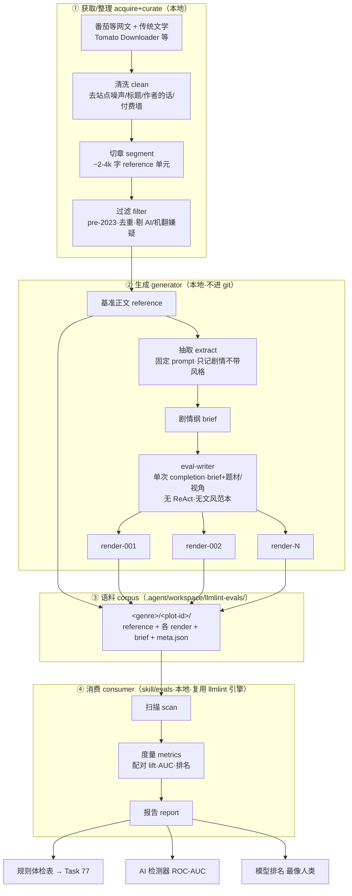

# llmlint Eval Harness

> Active task directory format: `NN-kebab-case-name/`. 规则修复属 [Task 77 llmlint Rule Registry](../77-llmlint-rule-registry/README.md);本任务只管**评测体系**——怎么量化"规则好不好、哪条该改"。

## Relative documents refs

- 被测对象:`assets/workspace/.nbook/agent/skills/llmlint/`
- 规则修复任务(本任务的下游消费者):[Task 77 llmlint Rule Registry](../77-llmlint-rule-registry/README.md)
- llmlint 历史源头:[Task 51 anti-ai-slop / llmlint skill](../51-anti-ai-slop-skill/README.md)
- 评测结构参考:`.agent/github/shuorenhua/evals/`(SF/SNF + 三轴评分 + 双模型交叉判分)
- 显形回归样本 #1:`workspace/ming-ding-zhi-shi-2/manuscript/001-volume/001-chapter/index.md`

## 术语 / Glossary

统一命名(稳定英文 key + 中文),代码与文档共用:

| key | 中文 | 含义 |
|---|---|---|
| `reference` | 基准正文 | 人类原文,评测标准(手动录入) |
| `brief` | 剧情纲 | 从 reference 抽出的剧情骨架,**不带句子级风格** |
| `extract` | 抽取 | reference → brief |
| `render` / `rendition` | 演绎 / 演绎本 | 照 brief 生成正文(act=render,产物=rendition)。**这就是"根据 brief 生成正文"** |
| `eval-writer` | 评测写手 | 执行 render 的生成器(每 模型×文风 一个配置) |
| `sample` | 样本 | 语料里一篇正文(reference 或某 rendition) |
| `plot group` | 题组 | 同一 brief 下 reference + 各 rendition 的集合(= 配对单元) |
| `repair` | 修复本 | llmlint 洗稿后的 AI 正文 |
| `critic` | 评分员 | 按参考给样本打分(后续) |
| `lift` | 判别增益 | AI/人 千字命中率之比 |
| `verdict bucket` | 裁决桶 | 强判别 / 弱 / 噪声 / 反指标 |
| `consumer` / `generator` | 消费侧 / 生成侧 | 打分仪器 / 造数据管线 |
| `corpus` | 语料 | 全部题组的集合 |

## 流程图 / Pipeline



(repair 修复本、critic 评分员属 M4,未画。)

## User Request / Topic

为 llmlint 建立评测体系。起因:用真实 DeepSeek 章节(已跑一轮 skill)做手测,发现工具产出 349 条散点命中,但用户能一句话给出 4 条诊断(过度描写、破折号、不是而是、机器人数据化);**散点与诊断之间的距离才是产品**,而且无评测就无法判断哪条规则是真信号、哪条是噪声。规则修复已交给另一个 agent(Task 77),本任务专注评测。

两类样本易得且可配对:① AI 生成正文 ② 网络小说/人类文学。用户强调要注意:**多模型生成** 与 **文学类型/作家风格**。AI 样本决定走 **NeuroBook 自己的 writer 管线**(writer 可配不同预设/文风)。

## Goal

/goal 建成 llmlint **判别挖掘 harness**:给定 AI/人类配对语料,量化每条规则在 AI vs 人 上的命中差(lift),产出可直接驱动规则修复的「规则体检表」。

- **Outcome**:一条命令,输出按 `体裁 × 模型 × 文风` 分层的 per-rule lift、人类侧误杀率、AI/人总分分离度;规则自动分入 `强判别 / 弱 / 噪声 / 反指标` 四桶。外加两个副产物:**llmlint 作 AI 检测器的聚合判别分**、各模型**「最像人类」排名**。
- **Verification surface**:在种子配对(DeepSeek 章 + 同体裁人类网文)上算出非平凡 lift;显形样本 #1 的 4 个已知 tell 能被对应规则的 lift 体现,或被明确标记为"需 LLM 通道覆盖,regex 不该管"。
- **Constraints**:不改 llmlint 规则与 CLI 逻辑(那属 Task 77);不把版权网文打包进 skill;消费侧代码放 `evals/` 但**本地化(gitignore + asset-sync 黑名单,已落),不进 git、不随系统 assets 同步**;语料库放 skill 之外(`.agent/workspace/llmlint-evals/`)。
- **Boundaries**:**复用 llmlint 引擎(直接 import `src/rules` + `src/scanner`,不 spawn CLI)**、evals 语料、shuorenhua evals 结构参考;不碰 runtime/gateway。
- **Iteration policy**:每轮记录改了什么、规则体检表怎么变、下一步最该补的样本或口径。
- **Blocked stop**:缺同体裁人类种子样本,或 writer 生成器无法批量驱动时,停下报告卡点与所需输入。

## Current State

- 设计已对齐,**尚未开始编码**。
- 已确认:三层评测模型、配对 lift 法、先建判别挖掘 harness、AI 样本走 writer 管线。
- 已查明 writer 管线现实(见下),据此定下"解耦、先用便宜样本种子化仪器"的实施路线。
- 数据管线架构定型:**消费侧(skill 仓库,进 git)只接收数据;生成侧(本地,不进 git,依赖 NeuroBook)产数据**。本轮主任务 = 判别验证(副产物:AI 检测器 + 最像人类模型排名)。
- 消费侧本地化定案:放 `evals/` 但 gitignore + asset-sync 黑名单(已落),语料外置 `.agent/workspace/llmlint-evals/`。
- 术语已对齐(见 Glossary);生成侧 writer 方案讨论中(倾向专用 eval-writer,见 Decisions)。

## Decisions / Discussion

### 评测分三层,数据/标签/指标/消费者各不同,严禁混淆

| 层 | 测什么 | 标签来源 | 规模 | 消费者 |
|---|---|---|---|---|
| ① 判别挖掘 | 每条规则在 AI vs 人 的命中差(lift) | 文档级**自动**(知道哪篇 AI/人即可) | 千级 | Task 77 改规则的 agent |
| ② 产品成绩单 | before→after 改写有没有更好 | LLM/人评判 | 百级 | 衡量 skill 整体 |
| ③ 显形回归 | 已知 tell 有没有被 pipeline 顶出来、没被淹 | 手工标 top-tell | 十级 | 防 surfacing 回归 |

**第一步只建第 ① 层**(用户拍板):最便宜(自动标签)、最快见效(直接喂改规则的 agent)、且一次把"多模型 + 体裁分层"基础设施建好。

### 核心方法:配对 lift

- `lift(rule) = AI 命中率 / 人类命中率`(均按千字归一,带平滑防除零)。
- 同剧情配对天然控制"剧情 + 体裁"两个混淆变量,优于"AI 科幻 vs 人类言情"。
- 裁决桶:`lift ≥ 3 强判别 / 1.5–3 弱 / 0.67–1.5 噪声(删) / < 0.67 反指标(人比 AI 还多,有害,删)`(阈值可调)。
- 必须按 `体裁 × 模型 × 文风` 分层;**多模型分别报一致性**——只在某模型高=脆规则;跨模型都高=稳 tell。

### 用户两点关切的落地

- **多模型** → lift 分模型报 + 区分"通用 tell / 某模型专属 tell";语料 pin 模型版本与日期(tell 会随模型版本漂移,语料是活资产)。
- **文学类型/作家风格** → lift 按体裁分层;AI 生成必须**与人类参照同体裁**;文风预设见下,可枚举。

### Writer 管线现实(实施路线的关键约束)

- writer 是 **ReAct agent**(`assets/workspace/.nbook/agent/profiles/builtin/writer.profile.tsx`),经 Harness API `invoke_agent` 调,**无 CLI**;批量生成要自写 Node 脚本驱动 harness,且依赖 World Engine 状态 + brief。**是个子工程,非一行命令。**
- 文风预设可枚举:`assets/workspace/.nbook/agent/profiles/builtin/writer.home/styles/*.style.md`(约 5 个:反派萝莉轻喜剧 / izumi / femiris / darkside / v2-0510,带 frontmatter key/label/enabled)。→ AI 样本维度 = `模型 × 文风预设 × 难度档`。
- 模型由 session/harness 配置决定,profile 不写死 → 可在 harness 层变模型。
- **(2026-06-30 定案)eval-writer = 单次 LLM completion**(用户要"最原始的 LLM 文本"):**不碰 ReAct/多轮/工具**,不用 production writer。输入 = brief + 最小 题材/视角 标注(让它写对体裁),**baseline 不喂文风范本**,以测模型裸 AI 嗓音。文风预设(`*.style.md`)作可选的更难档(测"styling 能否盖住 tell"),不入 baseline。production writer 逐字真实性留作 M4 realism 审计。

### 实施路线:解耦,别让生成器卡住仪器

- **判别仪器(纯脚本)先建**,拿种子配对验证。
- **AI 样本难度梯度三档**:① 裸 prompt(直连 API,便宜)② 精调 prompt ③ **writer 管线(realistic)**。难度档 1-2 先用直连 API 量产喂仪器;档 3 待 writer 生成器建好再补。
- **人类样本优先 2023 前网文**(2026 年大量网文已 AI 辅助,会稀释 lift)。

### 数据管线架构(2026-06-30 用户补充,定型)

**消费/生成两侧硬分离:**
- **Skill 仓库侧(进 git,随 skill 发布)= 只消费数据**:eval 管线接收一个语料目录,跑 llmlint,产出判别报告。**不负责生成数据。**
- **生成侧(不进 git,本地依赖 NeuroBook)= 数据生成管线**:产出语料喂给消费侧。语料库与生成器都不进 git。

**生成数据流**:人类正文(标准,手动录入)→ AI 抽取剧情 brief → 各模型/文风管道照 brief 生成正文 →(可选)llmlint 修复后正文 →(可选)critic 审批员按参考给全池打分(数据后续可能有用)。

**本轮主任务(关键)**:验证每条规则能否很好区分 人类 vs LLM。两个副产物:
1. **llmlint 可作 AI 检测器**(聚合判别分)。
2. **"最像人类"的模型排名**(各模型聚合分,越低越像人 → 给 NeuroBook 选 writer 模型)。

**这条管线新增的承重风险:**
- **brief 颗粒度是新旋钮**:太细 → 把人类的结构/风格泄漏进 AI 正文 → lift 被低估;太粗 → AI 写的是另一个故事 → lift 被内容差污染。对策:brief 固定只记 剧情/节拍/人物/场景目标,**不带句子级风格**;抽取 prompt 固定并版本化入库。
- **人类基线纯度 = AI 检测器天花板**:人类样本若混入 2023 后 AI 辅助网文,"人类"类被污染,检测器变差是假象。
- **"最像人类"= "最不触发我们规则",非绝对**;且随后用同批数据调规则会循环 → 必须 holdout。
- **好的对齐**:NeuroBook 真实 writer 也是从 brief 写正文 → 这条管线测的正是上线场景,brief 诱导的痕迹正是我们要检测的,不是稻草人。

### ① 数据获取/整理层 + reference 策略(2026-06-30 用户补充)

生成侧最前面加一个 **acquire + curate** 层,决定 reference 怎么来(**reference 纯度 = 检测器天花板,这层承重**)。

**reference 策略(推荐)**:
- **主力 = 中文网文,6-8 主流题材 × 多作者**:玄幻/异世界、仙侠修真、都市(系统/爽文)、古言、现言、科幻末世、悬疑灵异、历史穿越。题材内要 作者/笔法 多样,并覆盖 第一/第三人称、对话密集/描写密集。
- **小量人类高端锚点 = 传统/严肃文学**(genre=`literary`):给检测器"极人类"参照,防规则误杀文学手法(长句、比喻、意识流),不进主力池。
- 质量偏中上;**强 pre-2023 偏置**——番茄 2024+ 内容大量 AI 辅助,混进来会污染"人类"类、压低 lift。

**acquire+curate 子阶段**:`acquire(下载)→ clean(去站点噪声/章节标题/作者的话/付费墙)→ segment(切 ~2-4k 字章节单元)→ tag(题材/匿名作者/来源/年份/视角/质量档)→ filter(pre-2023·去重·剔 AI/机翻嫌疑)`。

**获取工具**:Tomato-Novel-Downloader(Rust 预编译 exe,番茄小说,输出 TXT/EPUB)。CLI 只支持 `--update <book_id>` 更新已有书;新书要先 TUI/Web 交互拉一次 → acquire **半自动**(人工按题材选 book_id),clean 起自动化。**单一来源(番茄)= 人类类有平台 bias,v1 可接受,后续加 起点/传统文学 增广。**

**合规边界**:下载网文有版权/ToS 限制(工具自述"仅自读、看完即删")。本评测**严格本地、不入 git、不再分发**(已 gitignore+黑名单),低并发别压服务器;法律风险归用户。

### 护栏(借鉴 shuorenhua,升级成量化)

- 抄 SF/SNF 框架 + 目标(SF > 90% / SNF 误杀 < 10%)+ 三轴(自然/保真/可直接发)+ 长文留存 0.85 下限。
- 留 **holdout**:改规则的 agent 会盯 lift 调规则,必过拟合 → 最终分只在没调过的 test 集算。
- **lift 必要不充分**:有些 AI 高频的是好写法(比喻、排比),不想"修"它 → 一条规则要同时满足"高 lift"且"产品评判说修了更好"。判别挖候选,产品评判定生死,两层联动。
- **两个计数口径并存**:规则级 lift 用**原始命中**,文档负担用**去重 span**(防一句话被 6 条规则打的虚高)。

## Verification / Test

- 种子配对(DeepSeek 章 + 同体裁人类网文)能跑出非平凡 lift,规则正确分入四桶。
- 显形样本 #1(`workspace/ming-ding-zhi-shi-2/.../001-chapter/index.md`,DeepSeek 写、已跑一轮)残留 4 个已知 tell:**过度描写、破折号、不是而是、机器人数据化**。判别表应能体现:破折号规则高 lift(但当前被路由到 human 桶)、不是而是高 lift(已在 agent 桶)、机器人数据化需 LLM 规则 `register-mismatch`(regex 不该管)。
- 规则体检表可直接作为 Task 77 的 to-do 输入。

## Implementation Walkthrough

> 计划已审批(2026-06-30)。每轮实现报告记入本目录 `walkthroughs/`。

### 消费侧模块(主任务,放 `evals/`,本地化)

| 模块 | 职责 | 关键点 |
|---|---|---|
| `corpus.ts` | 读 + 校验语料 | 按 meta 契约加载;对"非自产语料"稳健(缺字段/文件不匹配/编码) |
| `scan.ts` | 每篇跑 llmlint | **直接 import `../src/rules` + `../src/scanner`,不 spawn CLI**;出 原始命中 + 去重 span |
| `metrics.ts` | lift / 检测器 / 排名 | 见下度量 |
| `report.ts` | 出报告 | `report.json` + `report.md`(规则体检表 + 检测器 AUC + 模型榜) |
| `score.ts` | CLI 入口 | `--corpus --out --holdout --min-support` |
| `fixtures/` | 手造微语料 | 验证数学,不依赖真实语料 |

度量:`fireRate = 原始命中 / 字数 × 1000`;`lift = (AI 中位 fireRate + α) / (人类中位 + α)`,分 `体裁×模型×文风` 层;`%pairs(AI>human)`;误杀率 = 人类侧 agent 桶 fireRate;四桶 + **min-support 守门**;`docScore = Σ w_r·fireRate` → AI vs 人 **ROC-AUC**;模型榜 = 各模型 docScore 中位数(越低越像人)。

**扫描边界**:纯扫描只覆盖 ~284 条 **regex 规则**;8 条 **LLM 规则**(含 `register-mismatch` = 机器人数据化)需 LLM judge,属 M5,本轮标"需 LLM 通道"。

### 语料 / meta 契约(consumer ↔ generator 唯一接口)

```
<corpus>/<genre>/<plot-id>/
  reference.md  render-001.md  render-002.md ...  brief.md
  meta.json   # 每篇 sample: {file, role:"reference"|"render"|"repair",
              #   model?, modelVersion?, styleKey?, difficulty?,
              #   split:"train"|"test", sourceUrl?, pubYear?, charCount}
```

判别时 `role:reference` = 人类类,`role:render` = AI 类;`repair` 单独统计(衡量"修复有没有把 AI 推向人类")。

### 里程碑

| M | 内容 | 需要用户 | 产出 |
|---|---|---|---|
| **M1** | 消费侧核心 + fixture | 无 | `score.ts` 跑通,数学验证 |
| **M2** | 首条真实 lift | 1 篇人类种子 | 真实规则体检表(微语料) |
| **M3** | 生成侧(eval-writer 多模型)扩量 | 模型清单 + API | 统计显著 lift + 检测器 AUC + 模型榜 |
| M4 | realism 审计(真 production writer)+ 修复 + critic | — | 难度档 3 + 全池打分 |
| M5 | LLM 规则判别 + 产品层 + 显形回归 | — | 完整三层 |

主任务 = M1–M3。

## TODO / Follow-ups

- [ ] **待用户提供**:一篇同体裁(穿越异世界奇幻)人类网文章节当种子,与 DeepSeek 章配对。
- [ ] 第一轮(主任务,本地):**消费侧打分脚本** `evals/`——复用 llmlint 引擎(import),出 规则体检表 + AI 检测器 AUC + 模型排名;定死 corpus/meta 契约。
- [ ] 生成侧(本地,不进 git):brief 抽取(固定 prompt,只记剧情不带风格)+ eval-writer 多模型/文风照 brief render。
- [ ] 之后:critic 审批员给全池(人类/原始 AI/修复 AI)按参考打分。
- [ ] 之后:第 ② 层产品成绩单、第 ③ 层显形回归集(以 4-tell DeepSeek 章为 #1)。
- [ ] 落地后同步 `PROJECT-STATUS.md` 与本 README。
